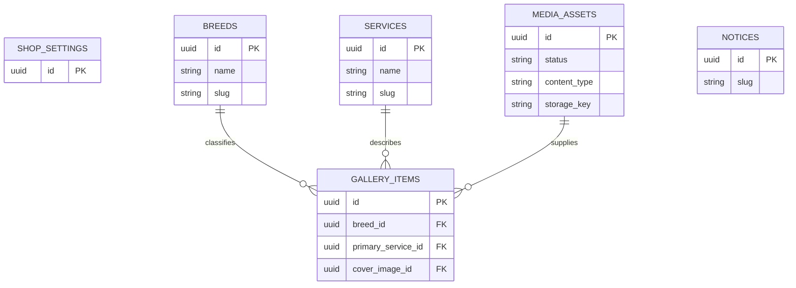

# 도메인 데이터 모델

## 구현 상태

- 현재 구현: Flyway V1의 `admin_users`, Flyway V2의 `breeds`·`services`, Flyway V3의 `notices`, Flyway V4의 `shop_settings`, Flyway V5의 `media_assets`
- 후속 구현: 갤러리와 매장정보 이미지 relation

`breeds`, `services`, `notices`, `shop_settings`, `media_assets`는 현재 schema와 관리 API 계약이고, 나머지 콘텐츠 모델은 제품 방향을 위한 proposed 계약이다.

## 현재 `admin_users`

| field | type | 필수 | 설명 |
|---|---|---:|---|
| `id` | UUID | Y | application-generated primary key |
| `email` | varchar(320) | Y | lowercase, unique |
| `password_hash` | varchar(255) | Y | BCrypt hash, API 비노출 |
| `role` | varchar(32) | Y | 현재 `ADMIN`만 허용 |
| `active` | boolean | Y | 기본 true, inactive login 거부 |
| `created_at` | timestamptz | Y | audit timestamp |
| `updated_at` | timestamptz | Y | audit timestamp |

schema source of truth는 `backend/src/main/resources/db/migration/V1__create_admin_users.sql`이다.

## 콘텐츠 공통 규칙

- primary key: UUID
- collection 공개 상태: `draft | published | archived`; 단일 현재값인 `shop_settings`에는 상태 없음
- 정렬: 작은 값이 먼저
- 게시·audit 시각은 timezone-aware timestamp로 저장한다. 매장 영업 시작·종료는 `TIME(0)` wall-clock 값이며 후속 공개 화면이 Asia/Seoul로 해석한다.
- slug: lowercase ASCII kebab-case, unique, 생성 후 관리 API에서 변경 불가
- raw HTML 입력 금지
- 공지 본문은 현재 Markdown source로 저장하고 후속 공개 build에서 sanitize
- 운영 삭제는 `archived`
- id, audit timestamp와 내부 field는 관리자 update DTO에서 제외

## 후속 관계



## 현재 `shop_settings` singleton

| field | type | 필수 | 설명 |
|---|---|---:|---|
| `id` | UUID | Y | 내부 primary key, API 비노출 |
| `singleton_key` | boolean | Y | 항상 true인 내부 one-row guard, API 비노출 |
| `shop_name` | varchar(100) | Y | 매장명 |
| `region_label` | varchar(100) | Y | 공개 지역 표기 |
| `business_type` | varchar(100) | Y | 업종 표기 |
| `phone` | varchar(32) | Y | 표시용 전화번호 |
| `address` | varchar(300) | Y | 공개 주소 |
| `opening_time` | time(0) without time zone | Y | `HH:mm` 영업 시작 |
| `closing_time` | time(0) without time zone | Y | `HH:mm` 영업 종료 |
| `closed_weekday` | varchar(9) | N | `MONDAY`~`SUNDAY` 중 하나 |
| `parking_available` | boolean | Y | 주차 가능 여부 |
| `parking_note` | varchar(300) | N | 주차 안내 |
| `hero_title` | varchar(200) | N | Hero 문구 |
| `hero_description` | varchar(1000) | N | Hero 설명 |
| `groomer_name` | varchar(100) | N | 운영자 표시명 |
| `groomer_intro` | varchar(2000) | N | 운영자 소개 |
| `reservation_notice` | varchar(4000) | N | 예약 전 안내 |
| `instagram_url` | varchar(2048) | N | HTTPS 외부 링크 |
| `naver_blog_url` | varchar(2048) | N | HTTPS 외부 링크 |
| `naver_map_url` | varchar(2048) | N | HTTPS 외부 링크 |
| `kakao_map_url` | varchar(2048) | N | HTTPS 외부 링크 |
| `naver_talktalk_url` | varchar(2048) | N | HTTPS 외부 링크 |
| `kakao_channel_url` | varchar(2048) | N | HTTPS 외부 링크 |
| `created_at`·`updated_at` | timestamp(6) with time zone | Y | microsecond audit timestamp |
| `created_by`·`updated_by` | UUID FK | Y | `admin_users(id)`, delete restrict |

- `singleton_key = TRUE` CHECK와 UNIQUE를 함께 사용해 application을 우회해도 row를 최대 하나만 허용한다.
- 필수 문자열은 Unicode whitespace 정규화 뒤 application에서 검증하고 DB의 nonblank CHECK로 다시 방어한다.
- `opening_time < closing_time`이며 overnight·요일별 복수 시간은 지원하지 않는다.
- 전화번호는 허용 문자와 숫자 개수를 application에서 검증한다.
- 선택형 URL은 absolute HTTPS, host 필수, userinfo·control 문자 금지를 application에서 검증하고 DB column이 최대 길이를 제한한다.
- 최초 PUT actor가 created/updated audit를 채우고 후속 PUT은 created audit를 보존한다. validation 실패는 모든 field와 audit를 보존한다.
- Hero·프로필·OG 이미지 식별자나 임시 path는 저장하지 않으며 `media_assets` FK relation은 후속 migration에서 추가한다.
- schema source of truth는 `backend/src/main/resources/db/migration/V4__create_shop_settings.sql`이다.

## 현재 `media_assets`

| field | type | 필수 | 설명 |
|---|---|---:|---|
| `id` | UUID | Y | application-generated primary key |
| `status` | varchar(16) | Y | `active | archived`, upload 기본 active |
| `source_content_type` | varchar(32) | Y | 실제 byte 기준 JPEG·PNG·HEIC·HEIF source type |
| `content_type` | varchar(32) | Y | canonical master의 JPEG 또는 PNG type |
| `file_extension` | varchar(8) | Y | server-owned `jpg | png` |
| `storage_key` | varchar(255) | Y | unique canonical `masters/<prefix>/<uuid>.<ext>`, API 비노출 |
| `source_byte_size` | bigint | Y | 변환 전 source byte, 최대 20 MiB |
| `byte_size` | bigint | Y | 저장 master byte, 최대 30 MiB |
| `width`·`height` | integer | Y | decode한 display dimension, 각 최대 12,000px·총 60MP |
| `sha256` | char(64) | Y | 저장 master lowercase SHA-256, dedupe unique 아님, API 비노출 |
| `created_at`·`updated_at` | timestamp(6) with time zone | Y | microsecond audit timestamp |
| `created_by`·`updated_by` | UUID FK | Y | `admin_users(id)`, delete restrict |

- JPEG·PNG source는 검증 뒤 같은 byte를 canonical private master로 이동한다.
- HEIC·HEIF source는 orientation을 pixel에 적용하고 sRGB로 변환한 metadata-free quality 92 JPEG만 master로 남긴다. raw source temp는 성공·실패 모두 제거한다.
- `storage_key`, type 조합, byte·dimension·pixel·hash와 actor FK를 명명된 PostgreSQL constraint로 최종 방어한다.
- 동일 hash row를 여러 개 허용하며 자동 dedupe하지 않는다.
- archive는 row와 master를 유지하고 status만 바꾸며 hard delete API는 없다.
- schema source of truth는 `backend/src/main/resources/db/migration/V5__create_media_assets.sql`이다.

## 현재 `breeds`

필드: id, status, name, unique slug, description, sort_order, created_at, updated_at, created_by, updated_by.

- 생성 상태는 항상 `draft`이고 생성 요청에서 status를 받지 않는다.
- publish 시 name과 slug가 유효해야 한다.
- 목록 정렬은 `sort_order ASC, name ASC, id ASC`다.
- actor field는 `admin_users(id)`를 참조하고 `ON DELETE RESTRICT`다.
- 공개 gallery가 없는 견종은 filter에 표시하지 않는다.
- 참조 중인 견종은 archive한다.

## 현재 `services`

필드: id, status, name, unique slug, description, price_text, sort_order, created_at, updated_at, created_by, updated_by.

- 생성 상태는 항상 `draft`이고 생성 요청에서 status를 받지 않는다.
- publish 시 description과 price_text가 필수이며 application과 `ck_services_published_fields`가 이중 검증한다.
- 목록 정렬은 `sort_order ASC, name ASC, id ASC`다.
- actor field는 `admin_users(id)`를 참조하고 `ON DELETE RESTRICT`다.

두 table의 schema source of truth는 `backend/src/main/resources/db/migration/V2__create_breeds_and_services.sql`이다. status·slug 형식·slug unique·name non-blank·sort_order와 actor FK constraint에는 식별 가능한 이름을 부여한다.

## `gallery_items` — planned

필드: id, status, dog name, breed relation, primary service relation, cover/before/after image relation, summary, alt text, featured, sort, performed/published timestamps, audit timestamps.

- publish 시 breed, service, cover image, 사실 기반 alt text와 published timestamp가 필수다.
- 관계 대상이 published가 아니면 공개 snapshot에서 제외한다.

## 현재 `notices`

필드: id, status, title, unique slug, summary, body Markdown, pinned, published/expires timestamps, audit timestamps.

- 생성 상태는 항상 `draft`이고 생성 요청에서 status를 받지 않는다. pinned 누락·null은 false다.
- title 200자, slug 160자, summary 300자, body Markdown 50,000자까지 관리 API에서 허용한다.
- title과 published body는 whitespace가 아닌 문자를 최소 하나 포함해야 하며 application과 `ck_notices_title_not_blank`·`ck_notices_published_fields`가 이중 검증한다.
- publish 시 title, immutable slug, non-blank body와 `published_at`이 필수다.
- `expires_at`은 없거나 상태와 무관하게 `published_at`이 존재하고 그보다 늦어야 하며 `ck_notices_window`가 최종 차단한다.
- 시간 API는 ISO-8601 offset/UTC를 받고 `published_at`, `expires_at`을 application에서 microsecond로 절삭한 뒤 최종 값으로 기간을 검증·반영한다. DB의 게시·만료·audit 시간 column은 `TIMESTAMP(6) WITH TIME ZONE`이다.
- 정규화 후 게시·만료가 같은 시각이면 거부하고 정확히 1µs 차이는 허용한다. 미래 `published_at`을 허용하고 만료만으로 status를 자동 변경하지 않는다.
- created_by·updated_by는 `admin_users(id)`를 참조하고 `ON DELETE RESTRICT`다.
- schema source of truth는 `backend/src/main/resources/db/migration/V3__create_notices.sql`이다.
- 공개 build 후보는 `status = published AND published_at <= build_time AND (expires_at IS NULL OR expires_at > build_time)`를 모두 만족해야 한다.

## 정렬

```text
services/breeds: sort_order ASC, name ASC, id ASC
gallery: featured DESC, sort ASC, published_at DESC, id ASC (planned)
notices: pinned DESC, published_at DESC NULLS LAST, updated_at DESC, id ASC
```

## 무결성 구현 원칙

- PostgreSQL constraint와 application validation을 역할에 맞게 이중 적용한다.
- publish validation은 `PUT`으로 받은 전체 mutable representation을 적용할 최종 entity 상태를 기준으로 수행한다.
- API request DTO allowlist로 id/audit/system field mass assignment를 차단한다.
- 공개 build query와 transformer가 published/relation/file 조건을 각각 검증한다.
