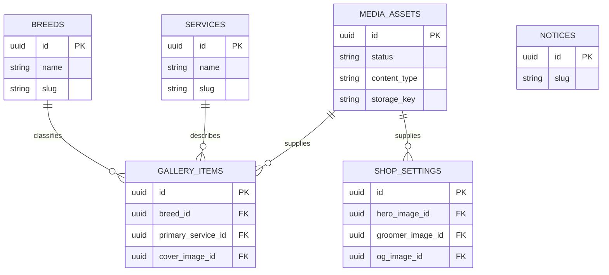

# 도메인 데이터 모델

## 구현 상태

- 현재 구현: Flyway V1의 `admin_users`, Flyway V2의 `breeds`·`services`, Flyway V3의 `notices`, Flyway V4·V7의 `shop_settings`, Flyway V5의 `media_assets`, Flyway V6의 `gallery_items`, Flyway V8의 `content_revision_state`·`publishing_outbox` producer, Flyway V9의 `publish_generation_state`와 outbox claim·lease·attempt/result state, Flyway V10의 `admin_webauthn_credentials`·`admin_recovery_codes`
- 현재 read model: active generation 기반 internal build snapshot·public-scope canonical media content
- 현재 publication read/use model: polling publisher·30초 debounce, actual Java→Node release executor, generated V2 content/media manifest, 공개 이미지 파생본과 Hero·프로필·OG 정적 렌더링, private release manifest·atomic switch
- 후속 구현: production Compose·secret·Mac path provisioning, operational status UI와 실제 public acceptance

`breeds`, `services`, `notices`, `shop_settings`, `media_assets`, `gallery_items`, V8·V9 publication table과 V10 관리자 second-factor table은 현재 schema 계약이다. Build API response, generated V2 snapshot/media manifest와 private release manifest는 이 schema를 변경하지 않는 current read/build model이다. release filesystem artifact는 PostgreSQL schema authority가 아니다.

## 현재 `admin_users`

| field | type | 필수 | 설명 |
|---|---|---:|---|
| `id` | UUID | Y | application-generated primary key |
| `email` | varchar(320) | Y | lowercase, unique |
| `password_hash` | varchar(255) | Y | BCrypt hash, API 비노출 |
| `role` | varchar(32) | Y | 현재 `ADMIN`만 허용 |
| `active` | boolean | Y | 기본 true, inactive login 거부 |
| `created_at` | timestamptz | Y | audit timestamp |
| `updated_at` | timestamptz | Y | audit timestamp |

schema source of truth는 `backend/src/main/resources/db/migration/V1__create_admin_users.sql`이다.

## 현재 관리자 WebAuthn·recovery state

### `admin_webauthn_credentials`

| field | type | 필수 | 설명 |
|---|---|---:|---|
| `id` | UUID | Y | server-generated row identity |
| `admin_user_id` | UUID FK | Y | `admin_users(id)`, delete 기본 restrict |
| `credential_id` | bytea | Y | authenticator public credential identifier, global unique |
| `credential_type` | varchar(32) | Y | 현재 public-key credential type |
| `public_key_cose` | bytea | Y | assertion 검증용 COSE public key |
| `signature_count` | bigint | Y | 0 이상인 authenticator counter |
| `uv_initialized` | boolean | Y | user-verification state metadata |
| `transports` | varchar(255) | Y | canonical transport metadata |
| `backup_eligible`·`backup_state` | boolean | Y | authenticator backup metadata |
| `attestation_object`·`attestation_client_data_json` | bytea | Y | 검증 library가 관리하는 registration evidence |
| `label` | varchar(100) | Y | nonblank operator label |
| `status` | varchar(16) | Y | `ACTIVE | REVOKED`; physical delete 없음 |
| `created_at`·`updated_at`·`last_used_at` | timestamp(6) with time zone | Y | server-owned audit/use timestamp |
| `revoked_at` | timestamp(6) with time zone | N | revoked일 때만 필수 |

passkey private key는 authenticator/device authority이며 server가 수집·저장·log하지 않는다. authentication lookup은 active credential만 사용하고 revoke는 audit row를 보존한다.

### `admin_recovery_codes`

| field | type | 필수 | 설명 |
|---|---|---:|---|
| `id` | UUID | Y | server-generated row identity |
| `admin_user_id` | UUID FK | Y | `admin_users(id)`, delete 기본 restrict |
| `code_set_id` | UUID | Y | 한 번에 발급한 recovery code set identity |
| `code_hash` | varchar(64) | Y | lowercase SHA-256, global unique; plaintext 저장 금지 |
| `created_at` | timestamp(6) with time zone | Y | set 발급 시각 |
| `used_at`·`revoked_at` | timestamp(6) with time zone | N | 사용 또는 set 폐기 terminal state |

recovery code 평문은 rotation response에서 한 번만 반환한다. 한 code가 사용되면 같은 set의 나머지를 폐기하고 새 set rotation 전까지 session은 `RECOVERY_ROTATION_REQUIRED`로 business API를 사용하지 못한다. 두 table의 source of truth는 `backend/src/main/resources/db/migration/V10__create_admin_webauthn_credentials_and_recovery_codes.sql`이며 V1~V9는 수정하지 않는다.

## 현재 publication database state

### `content_revision_state`

| field | type | 필수 | 설명 |
|---|---|---:|---|
| `singleton_key` | smallint | Y | primary key, CHECK로 1만 허용 |
| `content_revision` | bigint | Y | 0 이상인 콘텐츠 mutation snapshot revision |

- 초기 row는 `(1, 0)` 한 건이다.
- 지원 콘텐츠 mutation transaction이 `UPDATE ... SET content_revision = content_revision + 1 ... RETURNING`으로 한 번만 할당한다.
- PostgreSQL sequence가 아니므로 transaction rollback은 revision을 영구 소비하지 않는다. singleton row lock이 동시 mutation을 직렬화해 duplicate·lost revision을 막는다.

### `publishing_outbox`

| field | type | 필수 | 설명 |
|---|---|---:|---|
| `id` | UUID | Y | application-generated event primary key |
| `kind` | varchar(32) | Y | `CONTENT_CHANGED` 또는 Notice·Gallery scheduled kind |
| `source_type` | varchar(32) | Y | Shop·Breed·Service·Notice·Gallery·Media allowlist |
| `source_id` | UUID | Y | mutation source 식별자 |
| `content_revision` | bigint | Y | event를 만든 동일 mutation revision, 0 초과 |
| `available_at` | timestamp(6) with time zone | Y | immediate 생성 시각 또는 scheduled due 시각 |
| `expected_boundary_at` | timestamp(6) with time zone | N | scheduled event가 기대한 source boundary |
| `created_at` | timestamp(6) with time zone | Y | event 생성 시각 |
| `state` | varchar(16) | Y | 기본 `PENDING`, 승인 state allowlist |
| `publish_generation` | bigint | N | fresh eligible claim에 할당하는 unique positive ordering |
| `attempt_count` | smallint | Y | 기본 0, 최대 4 |
| `claim_owner` | varchar(128) | N | nonblank·trimmed·제어문자 없는 internal instance identifier |
| `claimed_at` | timestamp(6) with time zone | N | 현재·마지막 execution attempt 시작 시각 |
| `lease_until` | timestamp(6) with time zone | N | active `PROCESSING` lease 만료 시각 |
| `next_attempt_at` | timestamp(6) with time zone | N | `RETRY_WAIT` due 시각 |
| `completed_at` | timestamp(6) with time zone | N | terminal 완료 시각 |
| `last_result_code` | varchar(32) | N | fixed code allowlist, arbitrary error text 금지 |
| `coalesced_into_generation` | bigint | N | source보다 큰 실제 target generation self reference |

- immediate event는 `expected_boundary_at IS NULL`, scheduled event는 non-null이며 `available_at = expected_boundary_at`이다.
- `kind`, `source_type`, scheduled kind/source 조합을 named CHECK로 제한하고 `(available_at, id)`, `(source_type, source_id, available_at)`, `(content_revision)` index를 둔다.
- old scheduled event 보존과 stale 판정을 위해 source content FK나 cascade delete를 두지 않는다. event row는 current source authority가 아니며 후속 consumer가 source id·expected boundary로 current row를 재검증한다.
- V9 state는 `PENDING`, `PROCESSING`, `RETRY_WAIT`, `SUCCEEDED`, `NOOP`, `FAILED`, `COALESCED`로 제한한다. state별 generation·attempt·owner·lease·retry·completion nullability와 fixed result code를 named CHECK로 강제한다.
- scheduled stale event는 generation 할당 전 `NOOP / STALE_TRIGGER`, attempt 0으로 종료할 수 있다. generation이 있는 `NOOP`은 active attempt 뒤 `NO_PUBLIC_CHANGE` 또는 future stale 판정에 사용한다.
- `publish_generation`은 nullable UNIQUE이며 `coalesced_into_generation`은 같은 table의 generation을 `ON UPDATE/DELETE RESTRICT`로 참조하고 source보다 큰 값만 허용한다.
- claim/retry/lease selection용 `(state, available_at, id)`, `(state, next_attempt_at, id)`, `(state, lease_until, id)` index를 추가하고 V8 index를 보존한다.
- schema source of truth는 V8 producer migration과 `backend/src/main/resources/db/migration/V9__add_publishing_claim_and_generation_state.sql`이다.

### `publish_generation_state`

| field | type | 필수 | 설명 |
|---|---|---:|---|
| `singleton_key` | smallint | Y | primary key, CHECK로 1만 허용 |
| `publish_generation` | bigint | Y | 0 이상인 public trigger ordering authority |

- 초기 row는 `(1, 0)` 한 건이다.
- fresh eligible claim transaction이 `UPDATE ... + 1 RETURNING`으로 generation을 할당하고 같은 transaction에서 outbox를 첫 `PROCESSING` attempt로 전환한다.
- PostgreSQL sequence가 아니므로 claim transaction rollback은 generation을 소비하지 않는다. 자동 retry와 lease recovery는 기존 generation을 유지한다.
- 이 counter는 콘텐츠 mutation snapshot인 `content_revision_state`와 독립이다. 같은 `contentRevision`의 서로 다른 시간 경계도 각각 새 `publishGeneration`을 가질 수 있다.

## 현재 build snapshot read model

- Build API는 second-factor table을 public snapshot에 포함하지 않고 V1~V10 schema의 콘텐츠·publication current row만 하나의 read-only PostgreSQL `REPEATABLE READ` transaction에서 조회한다.
- active `PROCESSING` generation과 live lease가 request gate이고, response `contentRevision`은 해당 event의 과거 값이 아니라 같은 snapshot에서 읽은 current singleton 값이다.
- Build Snapshot V2 top-level은 `schemaVersion`, `contentRevision`, `publishGeneration`, server-owned microsecond `generatedAt`, `shop`, `services`, `breeds`, `galleryItems`, `notices`, `mediaAssets`만 허용한다.
- database source-of-truth는 `BIGINT`, Java internal source-of-truth는 `long`이다. HTTP/generated JSON 경계의 revision/generation만 canonical decimal string이며 `contentRevision`은 0 이상, `publishGeneration`은 1 이상이고 둘 다 `Long.MAX_VALUE` 이하다. 이 wire 변경 자체에는 DB column/type migration이 없다.
- Shop은 공개 business field 26개만, Breed·Service·Gallery·Notice는 각 public field allowlist만, media manifest는 `id`, `contentType`, `byteSize`, `width`, `height`만 반환한다.
- audit, status, storage key/path, persisted hash, source filename/type, claim owner·lease·event ID는 ordering·validation input일 수 있지만 DTO에는 노출하지 않는다.
- collection은 published/time 조건으로 filter하고 relation target·active media·실제 canonical master size/hash를 다시 검증한다. 명시적 invalid relation/file은 silent omission 없이 전체 snapshot 오류다.
- `codeImageDigest`는 Build API response가 아니라 publisher가 allowlist executor metadata로 결합해 private release manifest에 기록하는 field다. local/CI는 synthetic exact digest를 사용하고 production 승인 digest provisioning은 별도 gate다.

## 콘텐츠 공통 규칙

- primary key: UUID
- collection 공개 상태: `draft | published | archived`; 단일 현재값인 `shop_settings`에는 상태 없음
- 정렬: 작은 값이 먼저
- 게시·audit 시각은 timezone-aware timestamp로 저장한다. 매장 영업 시작·종료는 `TIME(0)` wall-clock 값이며 후속 공개 화면이 Asia/Seoul로 해석한다.
- slug: lowercase ASCII kebab-case, unique, 생성 후 관리 API에서 변경 불가
- raw HTML 입력 금지
- 공지 본문은 Markdown source로 저장하고 현재 공개 build에서 raw HTML disabled·URL allowlist·remote image alt-only 계약으로 정적 HTML을 생성
- 운영 삭제는 `archived`
- id, audit timestamp와 내부 field는 관리자 update DTO에서 제외

## 현재 콘텐츠 관계



## 현재 `shop_settings` singleton

| field | type | 필수 | 설명 |
|---|---|---:|---|
| `id` | UUID | Y | 내부 primary key, API 비노출 |
| `singleton_key` | boolean | Y | 항상 true인 내부 one-row guard, API 비노출 |
| `shop_name` | varchar(100) | Y | 매장명 |
| `region_label` | varchar(100) | Y | 공개 지역 표기 |
| `business_type` | varchar(100) | Y | 업종 표기 |
| `phone` | varchar(32) | Y | 표시용 전화번호 |
| `address` | varchar(300) | Y | 공개 주소 |
| `opening_time` | time(0) without time zone | Y | `HH:mm` 영업 시작 |
| `closing_time` | time(0) without time zone | Y | `HH:mm` 영업 종료 |
| `closed_weekday` | varchar(9) | N | `MONDAY`~`SUNDAY` 중 하나 |
| `parking_available` | boolean | Y | 주차 가능 여부 |
| `parking_note` | varchar(300) | N | 주차 안내 |
| `hero_title` | varchar(200) | N | Hero 문구 |
| `hero_description` | varchar(1000) | N | Hero 설명 |
| `groomer_name` | varchar(100) | N | 운영자 표시명 |
| `groomer_intro` | varchar(2000) | N | 운영자 소개 |
| `reservation_notice` | varchar(4000) | N | 예약 전 안내 |
| `hero_image_id` | UUID FK | N | Hero `media_assets(id)` |
| `hero_image_alt_text` | varchar(300) | N | Hero image와 pair인 사실 기반 대체텍스트 |
| `groomer_image_id` | UUID FK | N | 프로필 `media_assets(id)` |
| `groomer_image_alt_text` | varchar(300) | N | 프로필 image와 pair인 사실 기반 대체텍스트 |
| `og_image_id` | UUID FK | N | OG `media_assets(id)`, 별도 alt 없음 |
| `instagram_url` | varchar(2048) | N | HTTPS 외부 링크 |
| `naver_blog_url` | varchar(2048) | N | HTTPS 외부 링크 |
| `naver_map_url` | varchar(2048) | N | HTTPS 외부 링크 |
| `kakao_map_url` | varchar(2048) | N | HTTPS 외부 링크 |
| `naver_talktalk_url` | varchar(2048) | N | HTTPS 외부 링크 |
| `kakao_channel_url` | varchar(2048) | N | HTTPS 외부 링크 |
| `created_at`·`updated_at` | timestamp(6) with time zone | Y | microsecond audit timestamp |
| `created_by`·`updated_by` | UUID FK | Y | `admin_users(id)`, delete restrict |

- `singleton_key = TRUE` CHECK와 UNIQUE를 함께 사용해 application을 우회해도 row를 최대 하나만 허용한다.
- 필수 문자열은 Unicode whitespace 정규화 뒤 application에서 검증하고 DB의 nonblank CHECK로 다시 방어한다.
- `opening_time < closing_time`이며 overnight·요일별 복수 시간은 지원하지 않는다.
- 전화번호는 허용 문자와 숫자 개수를 application에서 검증한다.
- 선택형 URL은 absolute HTTPS, host 필수, userinfo·control 문자 금지를 application에서 검증하고 DB column이 최대 길이를 제한한다.
- 최초 PUT actor가 created/updated audit를 채우고 후속 PUT은 created audit를 보존한다. validation 실패는 모든 field와 audit를 보존한다.
- 세 image FK는 `media_assets(id) ON DELETE RESTRICT`이고 같은 asset의 다중 역할 재사용을 허용한다. 임시 path나 private storage metadata는 저장하지 않는다.
- Hero·프로필은 image와 Unicode trim·nonblank·최대 300 code-point alt가 함께 있거나 모두 null이어야 하며 DB CHECK와 application이 이중 검증한다. OG에는 alt field가 없다.
- PUT의 non-null image는 mutation 전에 존재와 `active` 상태를 확인한다. 후속 archive는 relation·audit에 cascade하지 않고 GET은 저장 UUID를 유지한다.
- build snapshot은 세 relation의 active status와 private canonical master 유효성을 다시 검증한다. 공개 파생 file은 후속 transformer가 생성·검증한다.
- schema source of truth는 `backend/src/main/resources/db/migration/V4__create_shop_settings.sql`과 `V7__add_shop_settings_media_relations.sql`이다.

## 현재 `media_assets`

| field | type | 필수 | 설명 |
|---|---|---:|---|
| `id` | UUID | Y | application-generated primary key |
| `status` | varchar(16) | Y | `active | archived`, upload 기본 active |
| `source_content_type` | varchar(32) | Y | 실제 byte 기준 JPEG·PNG·HEIC·HEIF source type |
| `content_type` | varchar(32) | Y | canonical master의 JPEG 또는 PNG type |
| `file_extension` | varchar(8) | Y | server-owned `jpg | png` |
| `storage_key` | varchar(255) | Y | unique canonical `masters/<prefix>/<uuid>.<ext>`, API 비노출 |
| `source_byte_size` | bigint | Y | 변환 전 source byte, 최대 20 MiB |
| `byte_size` | bigint | Y | 저장 master byte, 최대 30 MiB |
| `width`·`height` | integer | Y | decode한 display dimension, 각 최대 12,000px·총 60MP |
| `sha256` | char(64) | Y | 저장 master lowercase SHA-256, dedupe unique 아님, API 비노출 |
| `created_at`·`updated_at` | timestamp(6) with time zone | Y | microsecond audit timestamp |
| `created_by`·`updated_by` | UUID FK | Y | `admin_users(id)`, delete restrict |

- JPEG·PNG source는 검증 뒤 같은 byte를 canonical private master로 이동한다.
- HEIC·HEIF source는 orientation을 pixel에 적용하고 sRGB로 변환한 metadata-free quality 92 JPEG만 master로 남긴다. raw source temp는 성공·실패 모두 제거한다.
- `storage_key`, type 조합, byte·dimension·pixel·hash와 actor FK를 명명된 PostgreSQL constraint로 최종 방어한다.
- 동일 hash row를 여러 개 허용하며 자동 dedupe하지 않는다.
- archive는 row와 master를 유지하고 status만 바꾸며 hard delete API는 없다.
- schema source of truth는 `backend/src/main/resources/db/migration/V5__create_media_assets.sql`이다.

## 현재 `breeds`

필드: id, status, name, unique slug, description, sort_order, created_at, updated_at, created_by, updated_by.

- 생성 상태는 항상 `draft`이고 생성 요청에서 status를 받지 않는다.
- publish 시 name과 slug가 유효해야 한다.
- 목록 정렬은 `sort_order ASC, name ASC, id ASC`다.
- actor field는 `admin_users(id)`를 참조하고 `ON DELETE RESTRICT`다.
- 공개 gallery가 없는 견종은 filter에 표시하지 않는다.
- 참조 중인 견종은 archive한다.

## 현재 `services`

필드: id, status, name, unique slug, description, price_text, sort_order, created_at, updated_at, created_by, updated_by.

- 생성 상태는 항상 `draft`이고 생성 요청에서 status를 받지 않는다.
- publish 시 description과 price_text가 필수이며 application과 `ck_services_published_fields`가 이중 검증한다.
- 목록 정렬은 `sort_order ASC, name ASC, id ASC`다.
- actor field는 `admin_users(id)`를 참조하고 `ON DELETE RESTRICT`다.

두 table의 schema source of truth는 `backend/src/main/resources/db/migration/V2__create_breeds_and_services.sql`이다. status·slug 형식·slug unique·name non-blank·sort_order와 actor FK constraint에는 식별 가능한 이름을 부여한다.

## 현재 `gallery_items`

| field | type | 필수 | 설명 |
|---|---|---:|---|
| `id` | UUID | Y | application-generated primary key |
| `status` | varchar(16) | Y | `draft | published | archived`, 생성 기본 draft |
| `dog_name` | varchar(100) | N | Unicode trim, blank→null |
| `breed_id` | UUID FK | N | `breeds(id)`, publish 시 필수 |
| `primary_service_id` | UUID FK | N | `services(id)`, publish 시 필수 |
| `cover_image_id` | UUID FK | N | `media_assets(id)`, publish 시 필수 |
| `before_image_id`·`after_image_id` | UUID FK | N | 둘 다 있으면 서로 달라야 함 |
| `summary` | varchar(1000) | N | raw HTML 아님, Unicode trim, blank→null |
| `alt_text` | varchar(300) | N | 사실 기반 사진 설명, publish 시 nonblank 필수 |
| `featured` | boolean | Y | 기본 false |
| `sort_order` | integer | Y | 기본 100, 0 이상 |
| `performed_at`·`published_at` | timestamp(6) with time zone | N | application에서 microsecond로 절삭 |
| `created_at`·`updated_at` | timestamp(6) with time zone | Y | microsecond audit timestamp |
| `created_by`·`updated_by` | UUID FK | Y | `admin_users(id)`, delete restrict |

- 모든 breed·service·media FK는 `ON DELETE RESTRICT`이며 같은 media를 여러 항목이 참조할 수 있다. cover는 before 또는 after와 같아도 된다.
- `draft`·`archived`는 null이 아닌 relation row의 존재만 요구한다. `published`는 breed/service가 `published`, cover와 선택한 before/after media가 `active`여야 한다.
- relation 검증과 published 필수값 검증을 완료한 뒤 entity와 updated audit를 한 번에 반영한다. 실패 시 기존 row와 audit를 보존한다.
- 관계 대상이 나중에 draft·archived가 되어도 gallery status와 relation을 cascade 변경하지 않는다. build snapshot이 gallery status, relation status와 canonical master를 다시 검증하고 후속 transformer가 파생 file을 검증한다.
- schema source of truth는 `backend/src/main/resources/db/migration/V6__create_gallery_items.sql`이다.

## 현재 `notices`

필드: id, status, title, unique slug, summary, body Markdown, pinned, published/expires timestamps, audit timestamps.

- 생성 상태는 항상 `draft`이고 생성 요청에서 status를 받지 않는다. pinned 누락·null은 false다.
- title 200자, slug 160자, summary 300자, body Markdown 50,000자까지 관리 API에서 허용한다.
- title과 published body는 whitespace가 아닌 문자를 최소 하나 포함해야 하며 application과 `ck_notices_title_not_blank`·`ck_notices_published_fields`가 이중 검증한다.
- publish 시 title, immutable slug, non-blank body와 `published_at`이 필수다.
- `expires_at`은 없거나 상태와 무관하게 `published_at`이 존재하고 그보다 늦어야 하며 `ck_notices_window`가 최종 차단한다.
- 시간 API는 ISO-8601 offset/UTC를 받고 `published_at`, `expires_at`을 application에서 microsecond로 절삭한 뒤 최종 값으로 기간을 검증·반영한다. DB의 게시·만료·audit 시간 column은 `TIMESTAMP(6) WITH TIME ZONE`이다.
- 정규화 후 게시·만료가 같은 시각이면 거부하고 정확히 1µs 차이는 허용한다. 미래 `published_at`을 허용하고 만료만으로 status를 자동 변경하지 않는다.
- created_by·updated_by는 `admin_users(id)`를 참조하고 `ON DELETE RESTRICT`다.
- schema source of truth는 `backend/src/main/resources/db/migration/V3__create_notices.sql`이다.
- 공개 build 후보는 `status = published AND published_at <= build_time AND (expires_at IS NULL OR expires_at > build_time)`를 모두 만족해야 한다.

## 정렬

```text
services/breeds: sort_order ASC, name ASC, id ASC
gallery: featured DESC, sort_order ASC, published_at DESC NULLS LAST, id ASC
notices: pinned DESC, published_at DESC NULLS LAST, updated_at DESC, id ASC
```

## 무결성 구현 원칙

- PostgreSQL constraint와 application validation을 역할에 맞게 이중 적용한다.
- publish validation은 `PUT`으로 받은 전체 mutable representation을 적용할 최종 entity 상태를 기준으로 수행한다.
- API request DTO allowlist로 id/audit/system field mass assignment를 차단한다.
- 현재 build query와 후속 transformer가 published/relation/file 조건을 각각 검증한다.
- relation 대상의 후속 상태 변경을 gallery나 shop row에 cascade하지 않고 DB FK는 존재성과 hard delete 차단만 담당한다.
- 지원 콘텐츠 mutation은 최종 persistence 뒤 같은 transaction에서 revision을 한 번 할당한다. public impact와 새 Notice·Gallery boundary만 typed outbox event로 기록하며 event insert 실패를 무시하지 않는다.
