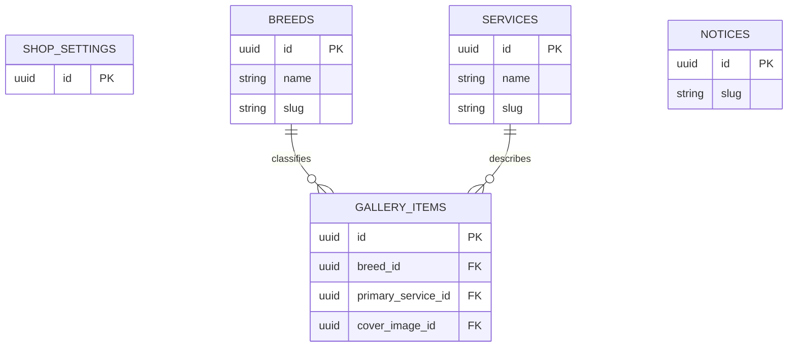

# 도메인 데이터 모델

## 구현 상태

- 현재 구현: Flyway V1의 `admin_users`
- 후속 구현: 매장정보, 견종, 서비스, 갤러리, 공지, 원본 이미지

아래 콘텐츠 모델은 제품 방향을 위한 proposed 계약이다. 이번 Issue에서 table이나 CRUD가 존재하는 것으로 해석하지 않는다.

## 현재 `admin_users`

| field | type | 필수 | 설명 |
|---|---|---:|---|
| `id` | UUID | Y | application-generated primary key |
| `email` | varchar(320) | Y | lowercase, unique |
| `password_hash` | varchar(255) | Y | BCrypt hash, API 비노출 |
| `role` | varchar(32) | Y | 현재 `ADMIN`만 허용 |
| `active` | boolean | Y | 기본 true, inactive login 거부 |
| `created_at` | timestamptz | Y | audit timestamp |
| `updated_at` | timestamptz | Y | audit timestamp |

schema source of truth는 `backend/src/main/resources/db/migration/V1__create_admin_users.sql`이다.

## 후속 콘텐츠 공통 규칙

- primary key: UUID
- 공개 상태: `draft | published | archived`
- 정렬: 작은 값이 먼저
- 시간: DB에는 timezone-aware timestamp, 화면은 Asia/Seoul
- slug: unique, 게시 후 변경 제한
- raw HTML 입력 금지
- 공지 본문은 Markdown 또는 제한된 rich text, build 시 sanitize
- 운영 삭제는 `archived`
- id, audit timestamp와 내부 field는 관리자 update DTO에서 제외

## 후속 관계



## `shop_settings` — planned singleton

필수 영역: 매장명·대표 문구, 전화·주소·영업시간·휴무·주차, 은총쌤 소개, 허용된 외부 link, Hero/소개/OG image relation, audit timestamp.

- 구조화 영업시간은 시작·종료·휴무 요일에서 생성한다.
- 복잡한 요일별 시간은 별도 ADR로 확장한다.
- 선택형 URL이 없으면 button을 숨긴다.

## `breeds` — planned

필드: id, status, name, unique slug, description, sort, audit timestamps.

- 공개 gallery가 없는 견종은 filter에 표시하지 않는다.
- 참조 중인 견종은 archive한다.

## `services` — planned

필드: id, status, name, unique slug, description, price text, sort, audit timestamps.

- publish 시 description과 price text가 필수다.

## `gallery_items` — planned

필드: id, status, dog name, breed relation, primary service relation, cover/before/after image relation, summary, alt text, featured, sort, performed/published timestamps, audit timestamps.

- publish 시 breed, service, cover image, 사실 기반 alt text와 published timestamp가 필수다.
- 관계 대상이 published가 아니면 공개 snapshot에서 제외한다.

## `notices` — planned

필드: id, status, title, unique slug, summary, body Markdown, pinned, published/expires timestamps, audit timestamps.

- publish 시 title, slug, body와 published timestamp가 필수다.
- `expires_at`은 없거나 `published_at`보다 늦어야 한다.
- build time이 `expires_at` 이상이면 공개 snapshot에서 제외한다.

## 정렬 — planned

```text
gallery: featured DESC, sort ASC, published_at DESC, id ASC
services/breeds: sort ASC, name ASC
notices: pinned DESC, published_at DESC, id ASC
```

## 무결성 구현 원칙

- PostgreSQL constraint와 application validation을 역할에 맞게 이중 적용한다.
- publish validation은 partial update 후의 최종 entity 상태를 기준으로 수행한다.
- API request DTO allowlist로 id/audit/system field mass assignment를 차단한다.
- 공개 build query와 transformer가 published/relation/file 조건을 각각 검증한다.
