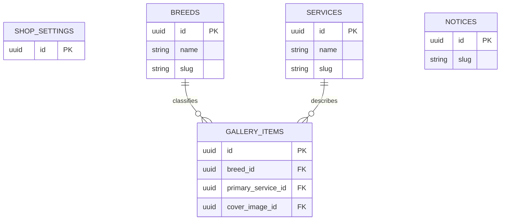

# 도메인 데이터 모델

## 구현 상태

- 현재 구현: Flyway V1의 `admin_users`, Flyway V2의 `breeds`·`services`, Flyway V3의 `notices`
- 후속 구현: 매장정보, 갤러리, 원본 이미지

`breeds`, `services`, `notices`는 현재 schema와 관리 API 계약이고, 나머지 콘텐츠 모델은 제품 방향을 위한 proposed 계약이다.

## 현재 `admin_users`

| field | type | 필수 | 설명 |
|---|---|---:|---|
| `id` | UUID | Y | application-generated primary key |
| `email` | varchar(320) | Y | lowercase, unique |
| `password_hash` | varchar(255) | Y | BCrypt hash, API 비노출 |
| `role` | varchar(32) | Y | 현재 `ADMIN`만 허용 |
| `active` | boolean | Y | 기본 true, inactive login 거부 |
| `created_at` | timestamptz | Y | audit timestamp |
| `updated_at` | timestamptz | Y | audit timestamp |

schema source of truth는 `backend/src/main/resources/db/migration/V1__create_admin_users.sql`이다.

## 콘텐츠 공통 규칙

- primary key: UUID
- 공개 상태: `draft | published | archived`
- 정렬: 작은 값이 먼저
- 시간: DB에는 timezone-aware timestamp, 화면은 Asia/Seoul
- slug: lowercase ASCII kebab-case, unique, 생성 후 관리 API에서 변경 불가
- raw HTML 입력 금지
- 공지 본문은 현재 Markdown source로 저장하고 후속 공개 build에서 sanitize
- 운영 삭제는 `archived`
- id, audit timestamp와 내부 field는 관리자 update DTO에서 제외

## 후속 관계



## `shop_settings` — planned singleton

필수 영역: 매장명·대표 문구, 전화·주소·영업시간·휴무·주차, 은총쌤 소개, 허용된 외부 link, Hero/소개/OG image relation, audit timestamp.

- 구조화 영업시간은 시작·종료·휴무 요일에서 생성한다.
- 복잡한 요일별 시간은 별도 ADR로 확장한다.
- 선택형 URL이 없으면 button을 숨긴다.

## 현재 `breeds`

필드: id, status, name, unique slug, description, sort_order, created_at, updated_at, created_by, updated_by.

- 생성 상태는 항상 `draft`이고 생성 요청에서 status를 받지 않는다.
- publish 시 name과 slug가 유효해야 한다.
- 목록 정렬은 `sort_order ASC, name ASC, id ASC`다.
- actor field는 `admin_users(id)`를 참조하고 `ON DELETE RESTRICT`다.
- 공개 gallery가 없는 견종은 filter에 표시하지 않는다.
- 참조 중인 견종은 archive한다.

## 현재 `services`

필드: id, status, name, unique slug, description, price_text, sort_order, created_at, updated_at, created_by, updated_by.

- 생성 상태는 항상 `draft`이고 생성 요청에서 status를 받지 않는다.
- publish 시 description과 price_text가 필수이며 application과 `ck_services_published_fields`가 이중 검증한다.
- 목록 정렬은 `sort_order ASC, name ASC, id ASC`다.
- actor field는 `admin_users(id)`를 참조하고 `ON DELETE RESTRICT`다.

두 table의 schema source of truth는 `backend/src/main/resources/db/migration/V2__create_breeds_and_services.sql`이다. status·slug 형식·slug unique·name non-blank·sort_order와 actor FK constraint에는 식별 가능한 이름을 부여한다.

## `gallery_items` — planned

필드: id, status, dog name, breed relation, primary service relation, cover/before/after image relation, summary, alt text, featured, sort, performed/published timestamps, audit timestamps.

- publish 시 breed, service, cover image, 사실 기반 alt text와 published timestamp가 필수다.
- 관계 대상이 published가 아니면 공개 snapshot에서 제외한다.

## 현재 `notices`

필드: id, status, title, unique slug, summary, body Markdown, pinned, published/expires timestamps, audit timestamps.

- 생성 상태는 항상 `draft`이고 생성 요청에서 status를 받지 않는다. pinned 누락·null은 false다.
- title 200자, slug 160자, summary 300자, body Markdown 50,000자까지 관리 API에서 허용한다.
- title과 published body는 whitespace가 아닌 문자를 최소 하나 포함해야 하며 application과 `ck_notices_title_not_blank`·`ck_notices_published_fields`가 이중 검증한다.
- publish 시 title, immutable slug, non-blank body와 `published_at`이 필수다.
- `expires_at`은 없거나 상태와 무관하게 `published_at`이 존재하고 그보다 늦어야 하며 `ck_notices_window`가 최종 차단한다.
- 시간 API는 ISO-8601 offset/UTC를 받고 `published_at`, `expires_at`을 application에서 microsecond로 절삭한 뒤 최종 값으로 기간을 검증·반영한다. DB의 게시·만료·audit 시간 column은 `TIMESTAMP(6) WITH TIME ZONE`이다.
- 정규화 후 게시·만료가 같은 시각이면 거부하고 정확히 1µs 차이는 허용한다. 미래 `published_at`을 허용하고 만료만으로 status를 자동 변경하지 않는다.
- created_by·updated_by는 `admin_users(id)`를 참조하고 `ON DELETE RESTRICT`다.
- schema source of truth는 `backend/src/main/resources/db/migration/V3__create_notices.sql`이다.
- 공개 build 후보는 `status = published AND published_at <= build_time AND (expires_at IS NULL OR expires_at > build_time)`를 모두 만족해야 한다.

## 정렬

```text
services/breeds: sort_order ASC, name ASC, id ASC
gallery: featured DESC, sort ASC, published_at DESC, id ASC (planned)
notices: pinned DESC, published_at DESC NULLS LAST, updated_at DESC, id ASC
```

## 무결성 구현 원칙

- PostgreSQL constraint와 application validation을 역할에 맞게 이중 적용한다.
- publish validation은 `PUT`으로 받은 전체 mutable representation을 적용할 최종 entity 상태를 기준으로 수행한다.
- API request DTO allowlist로 id/audit/system field mass assignment를 차단한다.
- 공개 build query와 transformer가 published/relation/file 조건을 각각 검증한다.
