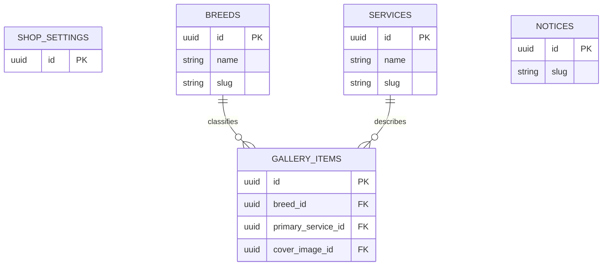

# CMS 데이터 모델

## 공통 규칙

- 사용자 컬렉션 기본키: UUID
- 공개 상태: `draft | published | archived`
- 정렬: 작은 값이 먼저
- 시간: DB에는 timezone-aware timestamp, 화면은 Asia/Seoul 기준
- slug: 고유하고 게시 후 변경을 제한
- HTML 직접 입력 금지
- 공지 본문은 Markdown 또는 제한된 rich text를 사용하고 빌드 시 sanitize
- 운영 삭제는 `archived`

## 관계



## `shop_settings` — Singleton

| 필드 | 타입 | 필수 | 설명 |
|---|---|---:|---|
| `id` | UUID | Y | singleton key |
| `name` | string | Y | 라오미펫 |
| `tagline` | string | Y | 한 줄 소개 |
| `hero_title` | string | Y | 대표 문구 |
| `hero_description` | text | N | 보조 설명 |
| `phone` | string | Y | 표시용 전화번호 |
| `address_country` | string | Y | `KR` |
| `address_region` | string | Y | 경기도 |
| `address_locality` | string | Y | 용인시 처인구 |
| `street_address` | string | Y | 중부대로1158번길 12 상가동 1층 104호 |
| `opening_time` | time | Y | 10:00 |
| `closing_time` | time | Y | 19:00 |
| `closed_weekday` | enum | Y | MONDAY |
| `business_hours_display` | string | Y | 화면 표시 문구 |
| `parking_available` | boolean | Y | 주차 여부 |
| `parking_text` | string | N | 상세 주차 안내 |
| `groomer_name` | string | Y | 은총쌤 |
| `groomer_intro` | text | N | 소개 |
| `hero_image` | file | Y at publish | Hero 원본 |
| `groomer_image` | file | N | 소개 원본 |
| `og_image` | file | Y at launch | 공유 대표 이미지 |
| `instagram_url` | URL | Y | 인스타그램 |
| `blog_url` | URL | Y | 네이버블로그 |
| `naver_map_url` | URL | Y | 네이버지도 |
| `kakao_map_url` | URL | Y | 카카오맵 |
| `naver_talktalk_url` | URL | N | 값 없으면 버튼 숨김 |
| `kakao_url` | URL | N | 값 없으면 버튼 숨김 |
| `updated_at` | timestamp | Y | 자동 |

구조화 영업시간은 `opening_time`, `closing_time`, `closed_weekday`에서 생성한다. 복잡한 요일별 영업시간이 필요해지면 별도 ADR로 모델을 확장한다.

## `breeds`

| 필드 | 타입 | 필수 | 설명 |
|---|---|---:|---|
| `id` | UUID | Y | |
| `status` | enum | Y | 기본 `draft` |
| `name` | string | Y | 예: 비숑 프리제 |
| `slug` | string | Y | unique |
| `description` | text | N | 견종별 SEO 페이지용 고유 설명 |
| `sort` | integer | Y | 기본 100 |
| `created_at` | timestamp | Y | 자동 |
| `updated_at` | timestamp | Y | 자동 |

- 공개 사진이 없는 견종은 홈 필터에 표시하지 않는다.
- 참조 중인 견종은 보관 처리한다.
- 견종별 SEO 페이지는 설명과 사진 기준을 충족할 때만 생성한다.

## `services`

| 필드 | 타입 | 필수 | 설명 |
|---|---|---:|---|
| `id` | UUID | Y | |
| `status` | enum | Y | |
| `name` | string | Y | 전체미용 등 |
| `slug` | string | Y | unique |
| `description` | text | Y at publish | |
| `price_text` | string | Y at publish | 초기 `상담 후 안내` |
| `sort` | integer | Y | |
| `created_at` | timestamp | Y | 자동 |
| `updated_at` | timestamp | Y | 자동 |

## `gallery_items`

| 필드 | 타입 | 필수 | 설명 |
|---|---|---:|---|
| `id` | UUID | Y | |
| `status` | enum | Y | |
| `dog_name` | string | N | 비공개 요청 시 비워둘 수 있음 |
| `breed` | M2O → breeds | Y at publish | |
| `primary_service` | M2O → services | Y at publish | |
| `cover_image` | file | Y at publish | 대표 원본 |
| `before_image` | file | N | 향후 비교 |
| `after_image` | file | N | 향후 비교 |
| `summary` | text | N | 짧은 설명 |
| `alt_text` | string | Y at publish | 사실 기반 |
| `featured` | boolean | Y | 기본 false |
| `sort` | integer | Y | 기본 100 |
| `performed_at` | date | N | 실제 시술일 |
| `published_at` | timestamp | Y at publish | |
| `created_at` | timestamp | Y | 자동 |
| `updated_at` | timestamp | Y | 자동 |

## `notices`

| 필드 | 타입 | 필수 | 설명 |
|---|---|---:|---|
| `id` | UUID | Y | |
| `status` | enum | Y | |
| `title` | string | Y | |
| `slug` | string | Y | unique, 게시 후 안정 유지 |
| `summary` | text | N | 목록·메타 설명 |
| `body_markdown` | text | Y at publish | raw HTML 금지 |
| `pinned` | boolean | Y | 기본 false |
| `published_at` | timestamp | Y at publish | |
| `expires_at` | timestamp | N | 만료 후 공개 제외 |
| `created_at` | timestamp | Y | 자동 |
| `updated_at` | timestamp | Y | 자동 |

## 정렬

### 갤러리

```text
featured DESC
sort ASC
published_at DESC
id ASC
```

### 서비스·견종

```text
sort ASC
name ASC
```

### 공지

```text
pinned DESC
published_at DESC
id ASC
```

## 데이터 무결성

- slug unique index
- status enum validation
- 공개 상태에서 관계·이미지·대체텍스트 필수
- URL scheme allowlist
- `expires_at > published_at`
- 영업 종료 시각이 시작 시각보다 늦음
- 보관된 견종·서비스를 새 공개 갤러리에 선택할 수 없음
