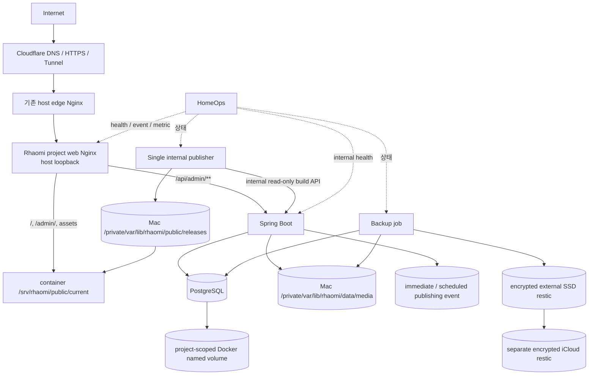

# 컨테이너 구조

## Phase 1C-7 local 개발 구성

`compose.dev.yaml`은 운영 구성과 분리된 `dev-rhaomi` project다.

| 서비스 | 고정 image | local 공개 | 영속화 |
|---|---|---|---|
| `frontend` | `node:24.20.0-alpine3.23` | 없음, gateway 전용 내부 3000 | `node_modules`, npm cache |
| `gateway` | `nginx:1.31.4-alpine3.24` | `127.0.0.1:3000` | 없음 |
| `backend` | exact Temurin 25 base + `libheif 1.23.0-r0` custom image | `127.0.0.1:8080` | Gradle cache, private media masters |
| `postgres` | `postgres:18.6-alpine3.23` | 없음 | backend PostgreSQL data |
| `smoke` | `node:24.20.0-alpine3.23` | 없음 | 없음 |
| `contract-check` | `node:24.20.0-alpine3.23` | 없음, network disabled | 기존 `node_modules`를 사용하는 frontend·repository contract 검증 |

- frontend·gateway·PostgreSQL·smoke·contract-check는 검증한 multi-architecture manifest digest를 고정한다. backend Dockerfile은 exact Temurin manifest digest와 `libheif=1.23.0-r0`·`libheif-dev=1.23.0-r0`를 고정한다.
- `frontend`와 `gateway`는 frontend profile에서 함께 실행하고 `smoke`는 smoke profile, `contract-check`는 validation profile에서만 실행한다.
- browser는 gateway `127.0.0.1:3000`만 사용한다. `/api/**`는 backend, 그 밖의 path와 HMR WebSocket은 frontend로 전달한다.
- frontend·gateway·smoke는 `frontend-local`, gateway·backend는 `backend-gateway-internal`, backend·PostgreSQL은 `backend-internal`에서 통신한다.
- gateway와 PostgreSQL은 network를 공유하지 않는다.
- backend만 별도 `dev-rhaomi-backend-local` network와 loopback port를 사용한다.
- PostgreSQL, backend, frontend와 gateway healthcheck가 통과해야 frontend stack을 정상으로 본다.
- 실제 값은 host Compose CLI가 Git 제외 `.env.dev.local`과 process 환경에서 읽어 필요한 service에만 주입한다.
- frontend는 repository root를 mount하지 않고 `src`, package manifest, Next·TypeScript config와 credential isolation script만 read-only allowlist mount한다. `.env*`, `backend/`, local secret/config와 private runtime data는 frontend filesystem에 없다.
- `contract-check`는 repository-wide Node contract에 필요한 tracked source만 read-only mount하고 network를 끈다. actual `.env.dev.local`은 mount하지 않으며 build token environment도 받지 않는다.
- local/test 관리자 bootstrap은 기본 비활성이며 production profile에서 사용할 수 없다.
- 일반 종료는 named volume을 보존하는 `docker compose ... down`을 사용한다.
- `backend-media-masters` volume은 backend만 `/var/lib/rhaomi/media`에 mount하고 frontend·smoke에는 mount하지 않는다.

## 개발 volume 경계

```text
dev-rhaomi-frontend-node-modules
dev-rhaomi-frontend-npm-cache
dev-rhaomi-backend-gradle-cache
dev-rhaomi-backend-media-masters
dev-rhaomi-postgres-18-backend-data
```

frontend dependency install과 runtime은 같은 `node_modules`·npm cache volume만 공유한다. credential은 이 cache에 주입하지 않으며 Compose smoke가 frontend environment, root mount와 generated output을 포함한 token literal 부재를 확인한다.

이전 Directus 개발 volume은 새 Compose에서 참조하지 않는다. 실제 운영 data가 아니더라도 이 Issue에서 삭제하지 않으며 별도 cleanup 승인 대상으로 남긴다.

## 운영 목표 구성 — planned



local private media volume·upload API와 same-origin development gateway까지 구현됐다. 위 production topology는 [ADR-010](../09-decisions/ADR-010-production-topology-and-code-release.md)~[ADR-014](../09-decisions/ADR-014-heic-decoder-only-production-runtime.md)에서 승인한 목표지만 production Compose·Nginx·publisher·backup·HomeOps와 decoder-only image는 아직 구현되지 않았다.

diagram의 iCloud repository는 Mac mini의 local iCloud Drive path다. [ADR-012](../09-decisions/ADR-012-application-consistent-backup-restore.md)에 따라 Apple remote sync가 별도 검증되기 전에는 offsite 사본이나 offsite RPO `PASS`로 간주하지 않는다.

## 서비스 책임

| 서비스 | 책임 | 외부 공개 |
|---|---|---|
| host edge Nginx | Cloudflare Tunnel의 기존 host 진입점과 project loopback route | Tunnel을 통해서만 |
| `rhaomi-web` | 정적 파일, same-origin `/api/admin/**` reverse proxy와 public deny rule | host loopback |
| `backend` | 관리자 session/auth, 콘텐츠 API, private media 검증·정규화·master 소유 | Nginx를 통해서만 |
| `postgres` | 관리자와 후속 콘텐츠 데이터 영속화 | 금지 |
| `publisher` | immediate pending·due scheduled event, overdue recovery, 두 revision, 30초 debounce, lock, snapshot·derivative·Static Export·atomic switch | 금지 |
| `backup` | application-consistent DB·private master restic backup과 local/offsite evidence 분리 | 금지 |
| HomeOps | 중앙 health·event·metric, incident·Activity·Discord와 제한된 자동 복구 | Tailscale 전용 |

## network 원칙

```text
host ingress
- cloudflared → host edge Nginx → loopback rhaomi-web

project application
- rhaomi-web → backend

data internal
- backend → PostgreSQL
- backend → private media

publisher internal
- publisher → read-only build API
- publisher → public releases/state/locks

ops internal
- backup → PostgreSQL/private media/restic repositories
- HomeOps → privacy-safe health/status/event/metric
```

- public path에서는 Rhaomi project web만 진입점이 되고 backend direct port와 PostgreSQL은 공개하지 않는다.
- public Nginx는 `/api/build/**`, `/internal/**`와 `/actuator/**`를 명시적으로 거부한다.
- publisher는 public network와 Docker socket을 사용하지 않는다.
- backup과 HomeOps는 project public network에 join하지 않는다.
- HomeOps UI·운영 endpoint와 Tailscale SSH는 public site와 분리한다.

## 운영 영속 경로 — planned

```text
/private/var/lib/rhaomi/
├── app/
├── public/
│   ├── releases/<release-id>/
│   ├── current -> releases/...
│   └── previous -> releases/...
├── data/
│   └── media/
├── state/
│   ├── publisher/
│   └── locks/
└── logs/
```

위 경로가 macOS host canonical contract다. `/srv/rhaomi`는 host bind source가 아니며 `synthetic.conf`나 Docker Desktop custom File Sharing을 production dependency로 두지 않는다.

| data | Mac host source | container target | lifecycle |
|---|---|---|---|
| public release | `/private/var/lib/rhaomi/public` | web·publisher `/srv/rhaomi/public` | host bind, web RO·publisher RW |
| canonical media | `/private/var/lib/rhaomi/data/media` | backend·publisher·backup `/var/lib/rhaomi/media` | host bind, backend RW·그 외 RO |
| publisher state | `/private/var/lib/rhaomi/state/publisher` | publisher `/var/lib/rhaomi/publisher` | host bind RW |
| global lock | `/private/var/lib/rhaomi/state/locks` | publisher `/var/lib/rhaomi/locks` | host bind RW |
| PostgreSQL PGDATA | production project-scoped named volume | PostgreSQL image PGDATA target | Docker-managed persistent volume |

exact host ownership·permission, rendered mount와 named-volume identity는 provisioning Issue에서 검증한다. container 삭제와 일반 Compose `down`은 PostgreSQL data를 삭제하지 않아야 하며 production `down -v`, volume prune/delete를 금지한다. DB backup/restore는 raw volume copy가 아니라 `pg_dump -Fc`·`pg_restore`를 authority로 사용한다.

## 공개 route — planned

```text
https://<public-domain>/          → 정적 사이트와 /admin auth shell
https://<public-domain>/api/admin/** → Spring Boot
```

- 최종 domain은 미정이다.
- 관리자 route의 noindex는 접근제어가 아니며 backend session·CSRF가 업무 요청을 보호한다.
- production session cookie는 TLS와 `Secure=true`가 필수다.
- `/api/build/**`, `/internal/**`, `/actuator/**`는 public Nginx에서 거부한다.

## 버전 고정

- `latest` tag 금지
- Node.js, Java image, Spring Boot, Gradle Wrapper, PostgreSQL, Nginx를 검증한 명시 버전으로 고정
- 운영 update는 backup, staging 검증과 rollback 계획이 있는 별도 PR로 수행
- production backend native image는 pinned source의 decoder-only libheif·libde265를 사용하고 x265 package·link 부재를 검증
