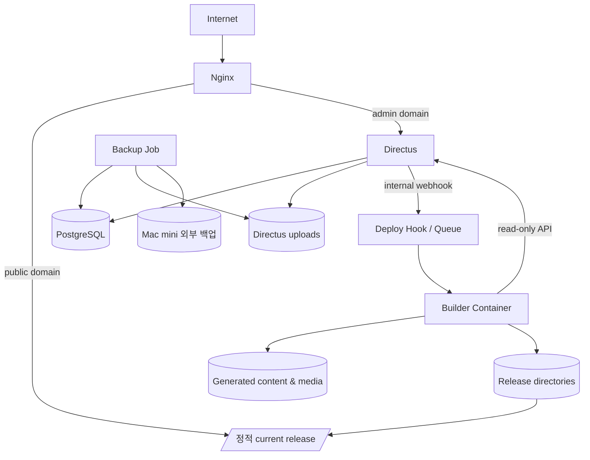

# 컨테이너 구조

## 운영 구성



## 서비스 책임

| 서비스 | 책임 | 외부 공개 |
|---|---|---|
| `nginx` | TLS 종료 또는 upstream 연계, 정적 파일 제공, Directus reverse proxy | 80/443 |
| `directus` | 관리자 UI, 콘텐츠 API, 파일 관리, Flow | Nginx를 통해 관리자 hostname만 |
| `postgres` | Directus와 콘텐츠 데이터 영속화 | 금지 |
| `deploy-hook` | 인증, 중복 빌드 합치기, build lock, 공통 배포 스크립트 호출 | 금지 |
| `builder` | 콘텐츠·이미지 동기화, Next 정적 빌드, 검증 | 금지 |
| `backup` | DB·업로드·스키마 백업과 보존 | 금지 |

## Docker network

권장 네트워크:

```text
edge
- nginx
- directus

cms-internal
- directus
- postgres
- deploy-hook
- builder

ops-internal
- backup
- postgres
- uploads
```

- PostgreSQL은 host port를 공개하지 않는다.
- deploy hook은 Docker 내부 DNS로만 호출한다.
- Builder는 운영 중 상시 실행할 필요 없이 작업 단위 컨테이너로 실행할 수 있다.
- Nginx만 공용 네트워크 진입점을 가진다.

## 영속 볼륨

```text
/srv/rhaomi/
├── postgres/
├── directus-uploads/
├── releases/
│   ├── 20260828T120000Z-<sha>/
│   └── ...
├── current -> releases/<active-release>/
├── previous -> releases/<previous-release>/
├── build-cache/
├── logs/
└── backups/
```

실제 경로는 Mac mini 운영 규칙에 맞게 확정하되, 컨테이너 삭제가 데이터 삭제로 이어지지 않게 한다.

## 공개 hostname

```text
https://<public-domain>          → 정적 사이트
https://admin.<public-domain>    → Directus
```

- 최종 도메인은 미정이다.
- 관리자 hostname은 검색 차단이 아니라 인증으로 보호한다.
- `robots.txt`만으로 관리자 보안을 해결하지 않는다.

## 버전 고정

- `latest` 태그 사용 금지
- Next.js, Node.js, Directus, PostgreSQL, Nginx를 검증한 명시 버전으로 고정
- 운영 업데이트는 백업, staging 검증, rollback 계획을 갖춘 PR로 수행
