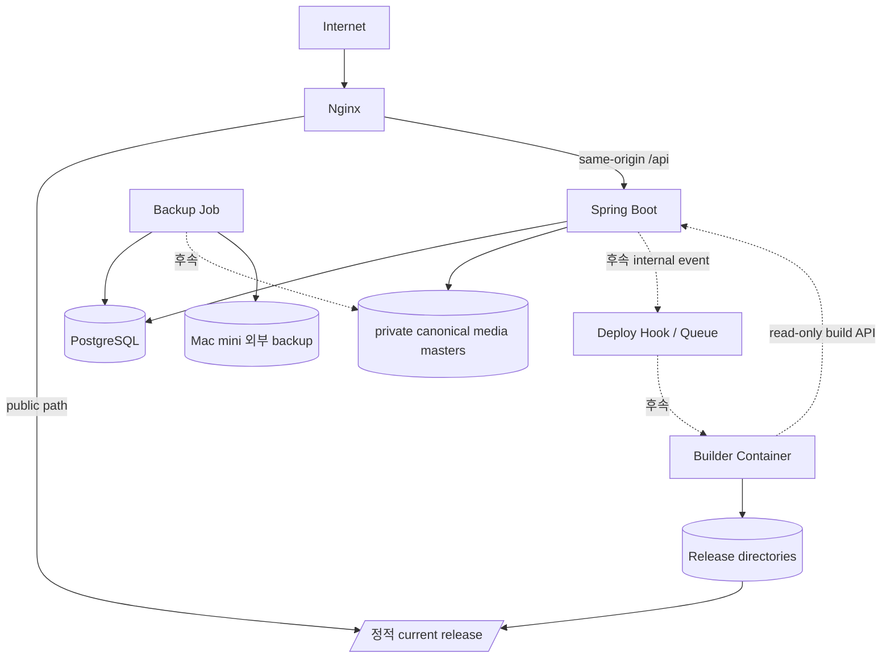

# 컨테이너 구조

## Phase 1C-7 local 개발 구성

`compose.dev.yaml`은 운영 구성과 분리된 `dev-rhaomi` project다.

| 서비스 | 고정 image | local 공개 | 영속화 |
|---|---|---|---|
| `frontend` | `node:24.20.0-alpine3.23` | 없음, gateway 전용 내부 3000 | `node_modules`, npm cache |
| `gateway` | `nginx:1.31.4-alpine3.24` | `127.0.0.1:3000` | 없음 |
| `backend` | exact Temurin 25 base + `libheif 1.23.0-r0` custom image | `127.0.0.1:8080` | Gradle cache, private media masters |
| `postgres` | `postgres:18.6-alpine3.23` | 없음 | backend PostgreSQL data |
| `smoke` | `node:24.20.0-alpine3.23` | 없음 | 없음 |

- frontend·gateway·PostgreSQL·smoke는 검증한 multi-architecture manifest digest를 고정한다. backend Dockerfile은 exact Temurin manifest digest와 `libheif=1.23.0-r0`·`libheif-dev=1.23.0-r0`를 고정한다.
- `frontend`와 `gateway`는 frontend profile에서 함께 실행하고 `smoke`는 smoke profile에서만 실행한다.
- browser는 gateway `127.0.0.1:3000`만 사용한다. `/api/**`는 backend, 그 밖의 path와 HMR WebSocket은 frontend로 전달한다.
- frontend·gateway·smoke는 `frontend-local`, gateway·backend는 `backend-gateway-internal`, backend·PostgreSQL은 `backend-internal`에서 통신한다.
- gateway와 PostgreSQL은 network를 공유하지 않는다.
- backend만 별도 `dev-rhaomi-backend-local` network와 loopback port를 사용한다.
- PostgreSQL, backend, frontend와 gateway healthcheck가 통과해야 frontend stack을 정상으로 본다.
- 실제 값은 Git 제외 `.env.dev.local`과 process 환경에서 주입한다.
- local/test 관리자 bootstrap은 기본 비활성이며 production profile에서 사용할 수 없다.
- 일반 종료는 named volume을 보존하는 `docker compose ... down`을 사용한다.
- `backend-media-masters` volume은 backend만 `/var/lib/rhaomi/media`에 mount하고 frontend·smoke에는 mount하지 않는다.

## 개발 volume 경계

```text
dev-rhaomi-frontend-node-modules
dev-rhaomi-frontend-npm-cache
dev-rhaomi-backend-gradle-cache
dev-rhaomi-backend-media-masters
dev-rhaomi-postgres-18-backend-data
```

이전 Directus 개발 volume은 새 Compose에서 참조하지 않는다. 실제 운영 data가 아니더라도 이 Issue에서 삭제하지 않으며 별도 cleanup 승인 대상으로 남긴다.

## 운영 목표 구성 — planned



local private media volume·upload API와 same-origin development gateway까지 구현됐다. 운영 Nginx·deploy·private media path provisioning과 backup 구현은 이번 Issue 범위가 아니다.

## 서비스 책임

| 서비스 | 책임 | 외부 공개 |
|---|---|---|
| `nginx` | TLS, 정적 파일, same-origin `/api/**` reverse proxy | 80/443 |
| `backend` | 관리자 session/auth, 콘텐츠 API, private media 검증·정규화·master 소유 | Nginx를 통해서만 |
| `postgres` | 관리자와 후속 콘텐츠 데이터 영속화 | 금지 |
| `deploy-hook` | 후속 인증·debounce·build lock | 금지 |
| `builder` | 후속 콘텐츠·이미지 동기화와 Static Export | 금지 |
| `backup` | DB와 후속 private master storage backup | 금지 |

## network 원칙

```text
edge
- nginx
- backend

backend-internal
- backend
- postgres
- deploy-hook
- builder

ops-internal
- backup
- postgres
- image storage
```

- PostgreSQL은 host port를 공개하지 않는다.
- builder와 deploy hook은 명시된 내부 route만 사용한다.
- Nginx만 공용 network 진입점을 가진다.

## 운영 영속 경로 — planned

```text
/srv/rhaomi/
├── postgres/
├── uploads/
├── releases/
├── current -> releases/<active-release>/
├── previous -> releases/<previous-release>/
├── build-cache/
├── logs/
└── backups/
```

실제 경로는 운영 계획에서 확정한다. 컨테이너 삭제가 data 삭제로 이어지지 않아야 한다.

## 공개 route — planned

```text
https://<public-domain>/          → 정적 사이트와 /admin auth shell
https://<public-domain>/api/**   → Spring Boot
```

- 최종 domain은 미정이다.
- 관리자 route의 noindex는 접근제어가 아니며 backend session·CSRF가 업무 요청을 보호한다.
- production session cookie는 TLS와 `Secure=true`가 필수다.

## 버전 고정

- `latest` tag 금지
- Node.js, Java image, Spring Boot, Gradle Wrapper, PostgreSQL, Nginx를 검증한 명시 버전으로 고정
- 운영 update는 backup, staging 검증과 rollback 계획이 있는 별도 PR로 수행
