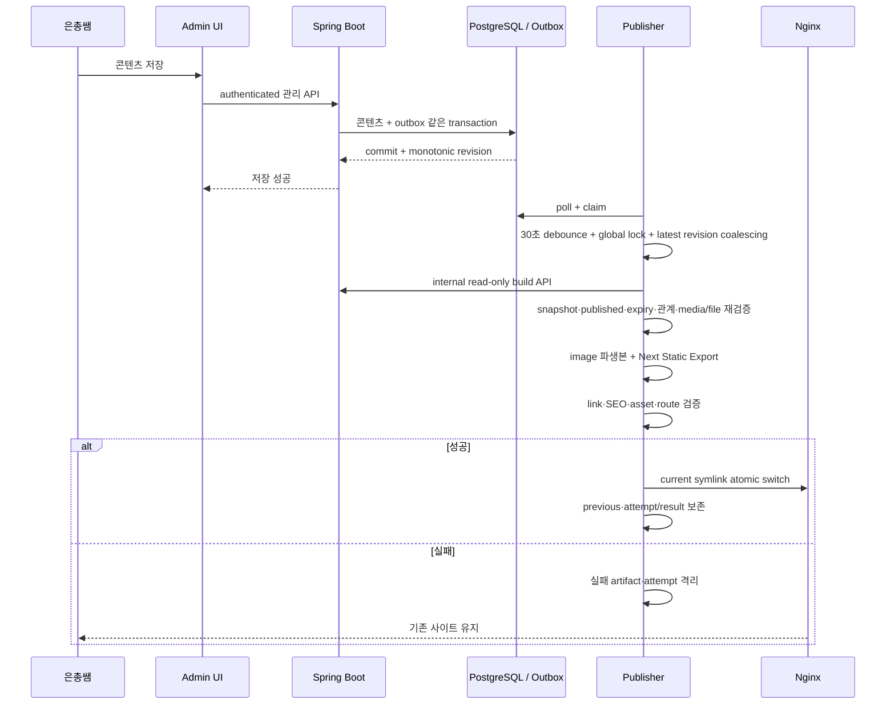

# 정적 퍼블리싱 파이프라인

## 구현 상태

Static Export 기반과 기존 release 유지, transactional outbox와 단일 publisher 방향은 [ADR-003](../09-decisions/ADR-003-static-publish-on-content-change.md)과 [ADR-011](../09-decisions/ADR-011-transactional-outbox-static-publisher.md)에서 승인됐다. 관리자 콘텐츠 API는 일부 구현됐지만 publishing outbox, build API, publisher와 public content route는 아직 구현되지 않았다. 이 문서는 후속 Issue가 따라야 할 목표 계약이다.

## 목적

은총쌤이 관리 backend에 저장한 공개 콘텐츠를 검색 가능한 정적 HTML에 반영하면서 실패 시 기존 영업 사이트를 보호한다.

## planned trigger

- 공개 결과·eligibility에 영향을 주는 콘텐츠 변경과 publishing outbox를 같은 PostgreSQL transaction에 기록한다.
- commit된 outbox에는 단조 증가하는 content revision을 부여한다.
- 공개 결과에 영향을 주지 않는 draft-only 변경은 불필요한 build를 만들지 않도록 분류한다.
- hard delete는 일반 운영 경로에 포함하지 않는다.
- 단일 internal publisher가 outbox를 claim하고 첫 변경 뒤 30초 debounce한다.
- global filesystem lock으로 code·content build를 직렬화한다.
- code release와 콘텐츠 release가 같은 검증·atomic switch 구현을 사용한다.

## planned pipeline

## 상세 단계

1. outbox poll·claim과 attempt 기록
2. 30초 debounce와 최신 revision coalescing
3. global filesystem lock
4. release ID, target revision과 승인된 production code image digest 확인
5. internal read-only build API로 일관된 snapshot 조회
6. snapshot schema, published, notice 게시·만료, 관계·media 상태와 실제 file scope 재검증
7. image download·validation·metadata 제거·responsive derivative 생성
8. Next.js build/export
9. HTML, link, canonical, sitemap, robots와 asset 검증
10. 새 release directory smoke
11. `previous` 기록과 `current` atomic switch
12. public smoke, 실패 시 previous 복귀
13. attempt/result와 마지막 성공 revision 기록
14. 새 revision이 있으면 최신 상태 우선 처리

## build API와 transformer 경계

- build credential은 관리자 session과 분리한다.
- build API는 internal network의 read-only snapshot·media endpoint만 제공한다.
- create, update, delete와 share는 모두 금지한다.
- public Nginx는 `/api/build/**`를 거부한다.
- API query와 transformer가 `published`, notice `published_at <= build timestamp < expires_at`, relation target, media `active`와 실제 file을 각각 검증한다.
- 선택된 media가 archived, missing 또는 corrupt면 silent omission하지 않고 build 전체를 실패시킨다.
- raw storage path, DB credential, admin session과 private metadata를 snapshot에 넣지 않는다.

## 원자성·일관성

- 활성 `current` 안에서 build하지 않는다.
- 모든 입력 조회가 성공하기 전 snapshot을 확정하지 않는다.
- 일부 최신/일부 과거 콘텐츠를 혼합하지 않는다.
- 검증 성공 전 symlink를 바꾸지 않는다.
- 오래된 build가 최신 release를 덮지 않도록 source revision을 비교한다.

## retry와 failure state

- 동일 revision의 transient 실패는 1분, 5분, 15분 간격으로 최대 3회 retry한다.
- validation·data 오류는 무한 retry하지 않는다.
- 새 revision이 있으면 최신 상태를 우선한다.
- 관리 API 저장 성공, publisher 처리 중, 공개 성공·실패를 서로 다른 상태로 기록한다.
- publisher는 state-changing 관리 request나 code deploy를 자동 재전송하지 않는다.

## 운영자 기대값

- 관리 API 저장 성공과 공개 반영 성공은 다른 상태다.
- 저장 직후 사이트에 즉시 보이지 않을 수 있다.
- 공개 반영 실패 시 기존 사이트를 유지한다.
- 후속 `/admin` UI나 상태 경로에서 build 결과를 확인할 수 있어야 한다.
- 마지막 성공·실패 revision과 명시적 수동 retry를 제공해야 한다.
