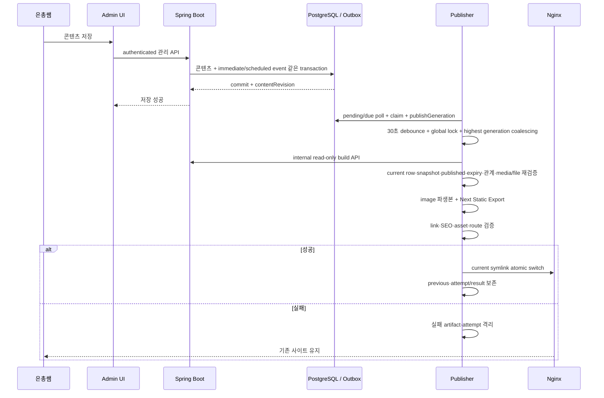

# 정적 퍼블리싱 파이프라인

## 구현 상태

Static Export 기반과 기존 release 유지, transactional outbox와 단일 publisher 방향은 [ADR-003](../09-decisions/ADR-003-static-publish-on-content-change.md)과 [ADR-011](../09-decisions/ADR-011-transactional-outbox-static-publisher.md)에서 승인됐다. Flyway V8과 domain service 연동으로 `contentRevision`·publishing outbox producer를 구현했고, Flyway V9과 internal Java service로 pending/due claim·lease recovery·`publishGeneration`·attempt/result state-machine 기반을 구현했다. 실제 polling loop, 30초 debounce orchestration, build API, publisher process와 public content route는 아직 구현되지 않았다. 이 문서는 현재 DB/state 경계와 후속 pipeline 계약을 함께 정의한다.

## 목적

은총쌤이 관리 backend에 저장한 공개 콘텐츠를 검색 가능한 정적 HTML에 반영하면서 실패 시 기존 영업 사이트를 보호한다.

## planned filesystem 경계

- Mac host release authority는 `/private/var/lib/rhaomi/public`이고 publisher container에는 `/srv/rhaomi/public`으로 read-write mount한다.
- Mac host publisher state와 lock은 각각 `/private/var/lib/rhaomi/state/publisher`, `/private/var/lib/rhaomi/state/locks`이고 container에는 `/var/lib/rhaomi/publisher`, `/var/lib/rhaomi/locks`로 mount한다.
- `/srv/rhaomi`는 Linux container target일 뿐 Mac host bind source가 아니다.
- web container는 같은 Mac public source를 `/srv/rhaomi/public`에 read-only mount한다. publisher만 새 release 설치와 `current`·`previous` atomic switch를 수행한다.
- actual Mac ownership·permission과 public/state bind·symlink atomicity는 production implementation gate에서 검증한다.

## trigger·orchestration 계약

- 공개 결과·eligibility에 영향을 주는 콘텐츠 변경과 publishing outbox를 같은 PostgreSQL transaction에 기록한다.
- 새로 설정·변경된 `publishedAt`·`expiresAt`이 있는 Notice create/update transaction은 event kind, `availableAt`, Notice ID와 current revision/boundary를 가진 durable scheduled event도 같은 transaction에 기록한다. 이미 지난 값도 consumer가 `availableAt <= now`로 처리할 수 있게 기록한다.
- Gallery가 published로 진입하거나 published 상태에서 non-null `publishedAt`이 변경되면 같은 transaction에 `GALLERY_PUBLISHED_AT_DUE`를 기록한다.
- `contentRevision`은 지원되는 콘텐츠 mutation마다 증가한다. draft-only mutation은 revision만 전진하고 public trigger는 만들지 않는다. `publishGeneration`은 immediate public-impact mutation, due publish/expiry boundary, 승인된 code release와 manual rebuild/retry가 public trigger로 처리될 때 증가한다.
- 공개 결과에 영향을 주지 않는 draft-only 변경은 불필요한 build를 만들지 않도록 분류한다.
- hard delete는 일반 운영 경로에 포함하지 않는다.
- 현재 internal state service가 immediate pending event와 `availableAt <= now`인 scheduled event를 single-claim하고 만료 lease·due retry를 같은 generation으로 복구할 수 있다.
- 후속 단일 publisher가 state service를 반복 호출하고 첫 accepted trigger 뒤 30초 debounce한다.
- scheduled claim은 current Notice·Gallery의 published 상태와 expected boundary만 최소 검증한다. 후속 publisher는 claim 뒤 current row가 다시 바뀔 수 있음을 전제로 전체 snapshot의 relation·media·file·`generatedAt` eligibility를 재검증한다.
- global filesystem lock으로 code·content build를 직렬화한다.
- code release와 콘텐츠 release가 같은 검증·atomic switch 구현을 사용한다.

## 현재 producer 경계

- V8 `content_revision_state` row increment와 outbox insert는 domain row mutation과 같은 PostgreSQL transaction에 참여한다.
- 한 성공 mutation은 save 횟수나 event 수와 무관하게 revision을 한 번만 할당한다. validation·DB·outbox failure와 rollback은 revision/event를 남기지 않는다.
- event kind/source/boundary는 typed column과 DB CHECK로 제한하며 JSON payload escape hatch는 없다.
- Media upload의 revision allocation이 실패하면 DB row와 이동한 final master를 함께 rollback/cleanup한다.
- producer는 build API, service credential, public route, claim loop나 scheduler를 포함하지 않는다.

## 현재 claim·generation state 경계

- V9은 transactional generation singleton, 일곱 state, 최대 attempt 4회, fixed result code와 state별 nullability를 PostgreSQL constraint로 강제한다.
- fresh pending/due claim은 `(availableAt, id)` 순서와 `FOR UPDATE SKIP LOCKED`를 사용하고 generation 할당·첫 attempt를 같은 transaction에서 기록한다. rollback은 event와 generation을 모두 원상태로 되돌린다.
- scheduled source가 없거나 현재 draft·archived·rescheduled이면 generation 없이 terminal stale no-op으로 기록한다. claim layer는 relation·media·file을 판단하지 않는다.
- active owner·generation·lease guard로 갱신·완료하고, expired lease와 1분·5분·15분 transient retry는 같은 generation을 유지한다. 네 번째 attempt 이후에는 retry exhausted로 종료한다.
- lower active generation을 실제 higher active generation에 연결하는 coalesce primitive가 있지만 30초 timer와 highest target 선택은 아직 구현하지 않았다.
- state service는 HTTP endpoint, service credential, polling/background execution, build와 filesystem 접근을 제공하지 않는다.

## planned pipeline

## 상세 단계

1. immediate pending·due scheduled event poll, overdue recovery와 claim·`publishGeneration`·첫 attempt의 atomic transaction
2. 30초 debounce와 가장 높은 accepted `publishGeneration` coalescing
3. global filesystem lock
4. release ID, target `contentRevision`·`publishGeneration`과 승인된 production code image digest 확인
5. internal read-only build API로 일관된 snapshot 조회
6. scheduled event라면 current Notice·Gallery row를 다시 읽고, snapshot schema, `generatedAt` 기준 published·게시/만료, 관계·media 상태와 실제 file scope 재검증
7. image download·validation·metadata 제거·responsive derivative 생성
8. Next.js build/export
9. HTML, link, canonical, sitemap, robots와 asset 검증
10. 새 release directory smoke
11. `previous` 기록과 `current` atomic switch
12. public smoke, 실패 시 previous code/current snapshot의 새 rollback generation으로 복구
13. attempt/result와 마지막 성공 `contentRevision`·`publishGeneration`·`generatedAt` 기록
14. 더 높은 generation이 있으면 최신 current snapshot 우선 처리

## build API와 transformer 경계

- build credential은 관리자 session과 분리한다.
- build API는 internal network의 read-only snapshot·media endpoint만 제공한다.
- create, update, delete와 share는 모두 금지한다.
- public Nginx는 `/api/build/**`를 거부한다.
- API query와 transformer가 `published`, notice `published_at <= build timestamp < expires_at`, relation target, media `active`와 실제 file을 각각 검증한다.
- 선택된 media가 archived, missing 또는 corrupt면 silent omission하지 않고 build 전체를 실패시킨다.
- raw storage path, DB credential, admin session과 private metadata를 snapshot에 넣지 않는다.

## 원자성·일관성

- publisher container의 활성 `current` 안에서 build하지 않는다.
- 모든 입력 조회가 성공하기 전 snapshot을 확정하지 않는다.
- 일부 최신/일부 과거 콘텐츠를 혼합하지 않는다.
- release manifest와 content snapshot에 `contentRevision`, `publishGeneration`, `generatedAt`을 함께 기록한다.
- 검증 성공 전 symlink를 바꾸지 않는다.
- target `publishGeneration`을 `current` manifest의 generation과 비교하고, 낮거나 같은 generation의 build는 최신 release를 덮지 못한다.
- 같은 `contentRevision`도 게시·만료 경계마다 서로 다른 generation과 공개 snapshot을 가질 수 있다.

## scheduled event 안전성

- Notice·Gallery가 reschedule, draft·archived 전환 또는 boundary 변경된 뒤 old scheduled event가 도착해도 current row와 `generatedAt` snapshot이 authority다.
- old event가 더 이상 공개 결과를 바꾸지 않으면 terminal no-op으로 기록하거나 가장 높은 pending generation에 합친다. correctness를 위해 old row를 물리 삭제할 필요는 없다.
- 가까운 여러 boundary를 debounce/coalesce해도 가장 높은 accepted generation의 최종 snapshot이 해당 `generatedAt`의 정확한 eligibility를 반영해야 한다.
- 주간 notice expiry 점검은 누락·drift를 찾는 audit/reconciliation이다. 예약 공개·만료 제거의 correctness trigger로 사용하지 않는다.

## retry와 failure state

- 동일 `publishGeneration`의 transient 실패는 1분, 5분, 15분 간격으로 최대 3회 retry한다.
- validation·data 오류는 무한 retry하지 않는다.
- 운영자가 승인한 manual rebuild/retry는 새 generation을 만들고, 새 generation이 있으면 최신 current snapshot을 우선한다.
- 관리 API 저장 성공, publisher 처리 중, 공개 성공·실패를 서로 다른 상태로 기록한다.
- publisher는 state-changing 관리 request나 code deploy를 자동 재전송하지 않는다.

## 운영자 기대값

- 관리 API 저장 성공과 공개 반영 성공은 다른 상태다.
- 저장 직후 사이트에 즉시 보이지 않을 수 있다.
- 공개 반영 실패 시 기존 사이트를 유지한다.
- 후속 `/admin` UI나 상태 경로에서 build 결과를 확인할 수 있어야 한다.
- 마지막 성공·실패 content revision·publish generation과 명시적 수동 retry를 제공해야 한다.
