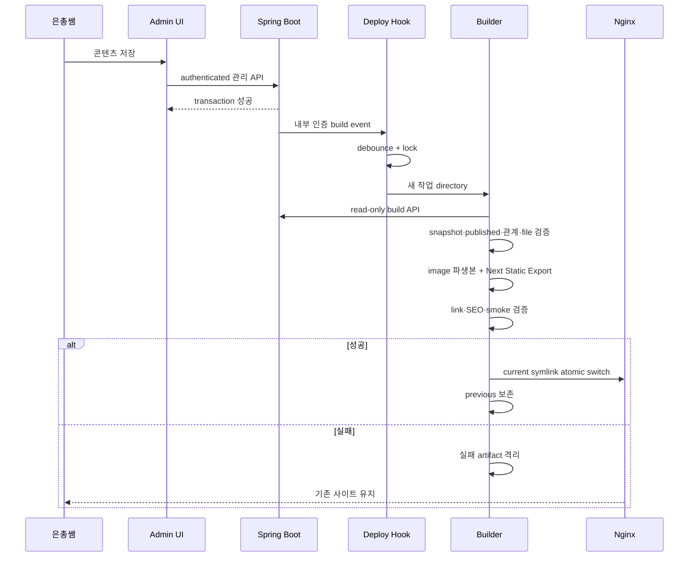

# 정적 퍼블리싱 파이프라인

## 구현 상태

Static Export 기반과 기존 release 유지 방향은 승인됐지만, 콘텐츠 CRUD, build API, event와 deploy hook은 아직 구현되지 않았다. 이 문서는 후속 Issue가 따라야 할 목표 계약이다.

## 목적

은총쌤이 관리 backend에 저장한 공개 콘텐츠를 검색 가능한 정적 HTML에 반영하면서 실패 시 기존 영업 사이트를 보호한다.

## planned trigger

- Spring Boot가 관련 콘텐츠 transaction을 성공시킨 뒤 domain event 또는 outbox를 기록한다.
- 비동기 내부 deploy hook이 인증된 build 요청을 받는다.
- hard delete는 일반 운영 경로에 포함하지 않는다.
- 연속 저장은 debounce하고 global build lock으로 직렬화한다.
- code release와 콘텐츠 release가 같은 검증·atomic switch 경로를 사용한다.

구체적인 event/outbox 방식은 콘텐츠 API Issue에서 transaction 일관성·재시도·중복 처리와 함께 확정한다.

## planned pipeline

## 상세 단계

1. 요청 인증과 event 중복 제거
2. global build lock
3. release ID와 exact code commit 확인
4. read-only build API 조회
5. snapshot schema·published·expiry·관계·file scope 검증
6. image download·validation·metadata 제거·변환
7. Next.js build/export
8. HTML, link, canonical, sitemap, robots 검증
9. 핵심 URL/file smoke
10. release directory 이동
11. `previous` 기록과 `current` atomic switch
12. 전환 후 smoke, 실패 시 previous 복귀
13. 대기 중 변경이 있으면 최신 상태로 한 번 재build

## 원자성·일관성

- 활성 `current` 안에서 build하지 않는다.
- 모든 입력 조회가 성공하기 전 snapshot을 확정하지 않는다.
- 일부 최신/일부 과거 콘텐츠를 혼합하지 않는다.
- 검증 성공 전 symlink를 바꾸지 않는다.
- 오래된 build가 최신 release를 덮지 않도록 source revision을 비교한다.

## 운영자 기대값

- 관리 API 저장 성공과 공개 반영 성공은 다른 상태다.
- 저장 직후 사이트에 즉시 보이지 않을 수 있다.
- 공개 반영 실패 시 기존 사이트를 유지한다.
- 후속 `/admin` UI나 상태 경로에서 build 결과를 확인할 수 있어야 한다.
