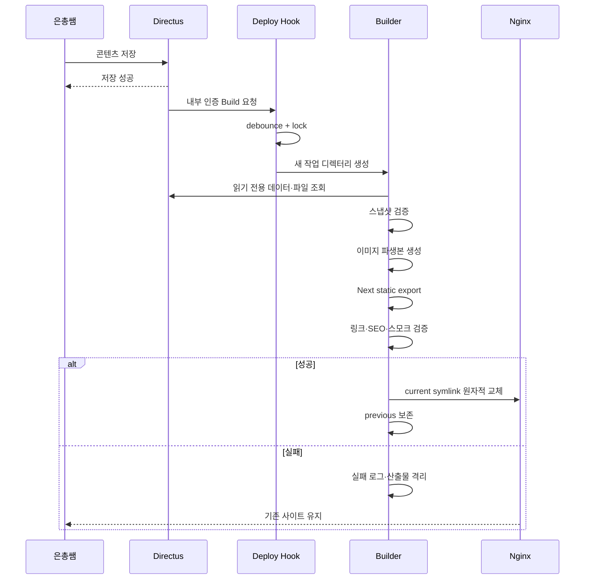

# 정적 퍼블리싱 파이프라인

## 목적

은총쌤이 Directus에서 저장한 공개 콘텐츠를 검색엔진이 읽을 수 있는 정적 HTML로 반영하면서, 실패 시 기존 영업 사이트를 보호한다.

## 트리거

### 콘텐츠 변경

Directus Flow가 아래 컬렉션의 create/update를 감지한다.

```text
shop_settings
services
breeds
gallery_items
notices
```

- Event Hook은 저장을 지연시키지 않는 non-blocking 방식
- 내부 `deploy-hook`으로 인증된 POST 요청
- hard delete는 운영자에게 금지하므로 일반 흐름에 포함하지 않음
- 초안 변경도 빌드를 유발할 수 있으나 작은 사이트에서는 정확성과 단순성을 우선
- 연속 저장은 deploy hook에서 debounce

### 코드 변경

- `main`의 검증된 변경이 같은 release 스크립트를 호출
- 코드와 콘텐츠 배포가 동시에 시작되면 단일 lock으로 직렬화

## 파이프라인



## 상세 단계

1. 요청 인증
2. 중복 요청 병합
3. 전역 build lock 획득
4. release ID 생성
5. Git의 배포 대상 commit 확인
6. CMS 데이터 조회
7. 스냅샷 schema 검증
8. 이미지 다운로드·변환
9. Next.js build/export
10. `out/` 존재와 크기 확인
11. HTML, 내부 링크, canonical, sitemap, robots 검증
12. 핵심 URL HTTP 또는 파일 스모크
13. release 디렉터리로 이동
14. `previous` 기록
15. `current` symlink atomic switch
16. Nginx 확인
17. 결과 로그
18. lock 해제
19. 대기 중 변경이 있으면 최신 상태로 한 번 더 빌드

## 원자성

- 활성 `current` 디렉터리 안에서 빌드하지 않는다.
- 모든 작업은 임시 release 디렉터리에서 수행한다.
- 검증 성공 전에는 symlink를 바꾸지 않는다.
- Nginx reload가 필요 없는 정적 root 구조를 우선한다.
- 전환 직후 스모크가 실패하면 `previous`로 즉시 복귀한다.

## 배포 일관성

빌드 중 추가 콘텐츠 변경이 발생할 수 있다.

- 각 빌드는 시작 시점의 일관된 스냅샷을 사용한다.
- 변경 감지 플래그가 있으면 현재 빌드 종료 후 다시 빌드한다.
- 오래된 빌드가 더 최신 결과를 덮지 않게 release sequence를 비교한다.

## 운영자 기대값

- Directus의 저장 성공과 공개 반영 성공은 다른 상태다.
- 저장 직후 사이트에 즉시 보이지 않을 수 있다.
- 공개 반영 실패 시 기존 사이트는 유지된다.
- 1차 Directus UI에는 배포 결과 표시가 없을 수 있으므로 운영자는 상태 페이지 또는 개발자 알림 절차를 따른다.
