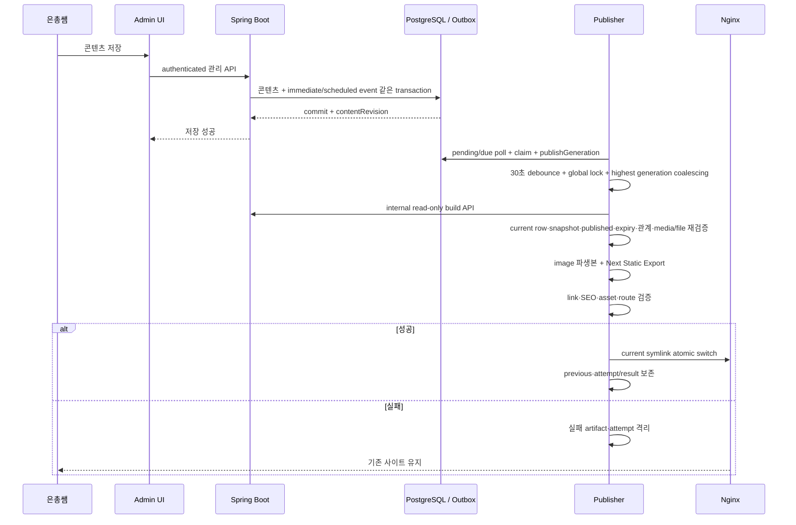

# 정적 퍼블리싱 파이프라인

## 구현 상태

Static Export 기반과 기존 release 유지, transactional outbox와 단일 publisher 방향은 [ADR-003](../09-decisions/ADR-003-static-publish-on-content-change.md)과 [ADR-011](../09-decisions/ADR-011-transactional-outbox-static-publisher.md)에서 승인됐다. Phase 1C-8f1~8f7은 Flyway V8/V9 producer·claim/generation state, internal Build API, strict transformer, dedicated control loop, generated V2 Static Export와 immutable release/atomic switch를 구현했다. Phase 1C-8f8은 synthetic production-like content를 local bootstrap·same-origin Admin HTTP로 저장한 뒤 draft/public/archive와 Notice future publish·expiry·overdue·stale/coalesce를 actual Java→Node release까지 검증하고, backend·PostgreSQL 중단 후 `current`를 read-only Nginx에서 계속 제공함을 증명한다. 이 구현은 task-scoped tmpfs/temp filesystem에 한정하며 production Mac path·secret·Compose/Nginx provisioning은 후속 운영 gate다.

## 목적

은총쌤이 관리 backend에 저장한 공개 콘텐츠를 검색 가능한 정적 HTML에 반영하면서 실패 시 기존 영업 사이트를 보호한다.

## planned filesystem 경계

- Mac host release authority는 `/private/var/lib/rhaomi/public`이고 publisher container에는 `/srv/rhaomi/public`으로 read-write mount한다.
- Mac host publisher state와 lock은 각각 `/private/var/lib/rhaomi/state/publisher`, `/private/var/lib/rhaomi/state/locks`이고 container에는 `/var/lib/rhaomi/publisher`, `/var/lib/rhaomi/locks`로 mount한다.
- `/srv/rhaomi`는 Linux container target일 뿐 Mac host bind source가 아니다.
- web container는 같은 Mac public source를 `/srv/rhaomi/public`에 read-only mount한다. publisher만 새 release 설치와 `current`·`previous` atomic switch를 수행한다.
- actual Mac ownership·permission과 public/state bind·symlink atomicity는 production implementation gate에서 검증한다.

## trigger·orchestration 계약

- 공개 결과·eligibility에 영향을 주는 콘텐츠 변경과 publishing outbox를 같은 PostgreSQL transaction에 기록한다.
- 새로 설정·변경된 `publishedAt`·`expiresAt`이 있는 Notice create/update transaction은 event kind, `availableAt`, Notice ID와 current revision/boundary를 가진 durable scheduled event도 같은 transaction에 기록한다. 이미 지난 값도 consumer가 `availableAt <= now`로 처리할 수 있게 기록한다.
- Gallery가 published로 진입하거나 published 상태에서 non-null `publishedAt`이 변경되면 같은 transaction에 `GALLERY_PUBLISHED_AT_DUE`를 기록한다.
- `contentRevision`은 지원되는 콘텐츠 mutation마다 증가한다. draft-only mutation은 revision만 전진하고 public trigger는 만들지 않는다. `publishGeneration`은 immediate public-impact mutation, due publish/expiry boundary, 승인된 code release와 manual rebuild/retry가 public trigger로 처리될 때 증가한다.
- 공개 결과에 영향을 주지 않는 draft-only 변경은 불필요한 build를 만들지 않도록 분류한다.
- hard delete는 일반 운영 경로에 포함하지 않는다.
- 현재 internal state service가 immediate pending event와 `availableAt <= now`인 scheduled event를 single-claim하고 만료 lease·due retry를 같은 generation으로 복구할 수 있다.
- exact opt-in으로 기동한 dedicated non-web publisher가 state service를 반복 호출하고 첫 accepted `PROCESSING` generation의 `claimedAt`부터 고정 30초 debounce한다. `T0 + 30s`에 due인 trigger는 포함하고 그 이후는 다음 window에 남긴다.
- scheduled claim은 current Notice·Gallery의 published 상태와 expected boundary만 최소 검증한다. build API는 claim 뒤 current row가 다시 바뀔 수 있음을 전제로 전체 snapshot의 relation·media·file·`generatedAt` eligibility를 재검증하고, 후속 transformer도 response를 다시 검증한다.
- executor 직전 container-side configurable `FileChannel.tryLock` global lock을 획득하고, 해당 executor body가 종료됐거나 시작 불가능하다는 wrapper acknowledgment까지 같은 lock scope를 유지한다. planned production container target은 `/var/lib/rhaomi/locks`이며 이번 단계는 production host path를 만들지 않는다.
- code release와 콘텐츠 release가 같은 검증·atomic switch 구현을 사용한다.

## 현재 producer 경계

- V8 `content_revision_state` row increment와 outbox insert는 domain row mutation과 같은 PostgreSQL transaction에 참여한다.
- 한 성공 mutation은 save 횟수나 event 수와 무관하게 revision을 한 번만 할당한다. validation·DB·outbox failure와 rollback은 revision/event를 남기지 않는다.
- event kind/source/boundary는 typed column과 DB CHECK로 제한하며 JSON payload escape hatch는 없다.
- Media upload의 revision allocation이 실패하면 DB row와 이동한 final master를 함께 rollback/cleanup한다.
- producer 자체는 build API, service credential, public route, claim loop나 scheduler를 포함하지 않는다.

## 현재 claim·generation state 경계

- V9은 transactional generation singleton, 일곱 state, 최대 attempt 4회, fixed result code와 state별 nullability를 PostgreSQL constraint로 강제한다.
- fresh pending/due claim은 `(availableAt, id)` 순서와 `FOR UPDATE SKIP LOCKED`를 사용하고 generation 할당·첫 attempt를 같은 transaction에서 기록한다. rollback은 event와 generation을 모두 원상태로 되돌린다.
- scheduled source가 없거나 현재 draft·archived·rescheduled이면 generation 없이 terminal stale no-op으로 기록한다. claim layer는 relation·media·file을 판단하지 않는다.
- active owner·generation·lease guard로 갱신·완료하고, expired lease와 1분·5분·15분 transient retry는 같은 generation을 유지한다. 네 번째 attempt 이후에는 retry exhausted로 종료한다.
- publisher control loop가 30초 fixed timer 동안 accepted generation을 비교하고 lower active claim을 실제 highest live target으로 즉시 coalesce한다. retry·recovery로 더 낮은 generation이 나중에 도착해도 executor authority는 highest로 유지한다.
- debounce와 async executor 대기 중 lease를 갱신하고 completion 직전 ownership을 다시 확인한다. renewal·coalesce·completion boolean false는 성공으로 취급하지 않는다.
- state service는 HTTP endpoint, service credential, polling/background execution, build와 filesystem 접근을 제공하지 않으며 control loop가 이 경계를 adapter로 조합한다.

## 현재 build API 경계

- `GET /api/build/snapshot?publishGeneration=<positive-long>`과 `GET /api/build/media/{id}/content?publishGeneration=<positive-long>`만 허용한다.
- 관리자 session과 분리된 64자 lowercase hex Bearer token을 timing-safe 비교하며 build chain은 stateless이고 session·request cache를 만들지 않는다.
- snapshot은 active `PROCESSING` generation과 live lease를 확인한 뒤 하나의 read-only `REPEATABLE READ` transaction에서 current `contentRevision`과 server-owned microsecond `generatedAt`을 읽는다. PostgreSQL `BIGINT`와 Java `long`은 유지하고 Build Snapshot V2 wire에서 revision/generation만 canonical decimal string으로 직렬화한다.
- exact DTO allowlist와 published/time/relation/media/file 조건을 검증하고 Shop·공개 가능한 Gallery가 참조한 distinct active media manifest만 반환한다.
- media content는 current public relation scope를 다시 확인하고 canonical master의 실제 size·SHA를 검증한 뒤 `private, no-store`·`nosniff`로 반환한다.
- build 호출은 revision·outbox·generation·lease·attempt·콘텐츠를 변경하지 않는다. dev/public Nginx는 `/api/build/**`를 backend로 proxy하지 않는다.

## 현재 transformer 경계

- exact `BuildSnapshotV2` top-level·entity key와 UUID·slug·microsecond Instant·URL, canonical int64 decimal string revision/generation, backend/build API가 정의한 field별 text/number limit, uniqueness, relation, published/time eligibility와 exact media manifest를 fail-closed로 다시 검증한다. Breed·Service description에는 publication-only 길이 제한을 두지 않는다.
- 문자열 canonical 검증은 JS `trim()` 공통 규칙이 아니다. Breed·Service·Notice는 Java `String.strip()`/`isBlank()`와 UTF-16 length, Shop은 `Character.isWhitespace() || Character.isSpaceChar()` strip과 code-point length, Gallery는 같은 strip과 Build API UTF-16 length를 각각 재현한다.
- source 배열의 Breed·Service canonical server order는 보존하고 media 처리·manifest는 UUID, profile, format, width의 고정 순서로 만든다.
- `MediaContentProvider`는 distinct media UUID당 한 번만 호출한다. HTTP·Bearer credential·session과 backend storage path는 transformer에 포함하지 않는다.
- JPEG·PNG signature/content type·decode·30 MiB·12,000px·60MP·single-image 조건을 확인한 뒤 orientation·sRGB·metadata 제거와 no-upscale AVIF·WebP·JPEG 파생본을 생성하고 결과도 decode·format·metadata로 재검증한다.
- output byte SHA-256 파일명으로 중복 file을 합치고 V2 `src/generated/content.json`, V2 `src/generated/media-manifest.json`, `public/generated/media`를 deterministic하게 생성한다. 두 JSON artifact와 staging result·machine CLI는 fetched revision/generation string을 byte-for-byte 보존하고 Node는 범위·equality·ordering에만 `BigInt`를 사용한다.
- 새 staging target과 같은 parent의 임시 directory를 완성한 뒤 rename한다. 실패 시 임시 산출물을 제거하며 이미 존재하는 성공 target을 교체하거나 current/previous를 조작하지 않는다.
- `SNAPSHOT_INVALID`, `MEDIA_NOT_FOUND`, `MEDIA_INVALID`, `MEDIA_TRANSFORM_FAILED`, `OUTPUT_FAILED`만 외부 오류 계약으로 사용하고 path·UUID·decoder detail을 출력하지 않는다.

## 현재 Build API adapter·release orchestration 경계

- environment-only internal origin과 64자 lowercase hex credential을 request 전에 검증한다. CLI argv는 positive Java long generation과 private staging path만 허용한다.
- redirect를 따르지 않는 fixed 10초 bounded GET의 `200 application/json` raw snapshot만 strict parser에 직접 전달하고 요청 generation과 parsed generation을 exact 비교한다.
- snapshot manifest 밖 media를 network 전에 거부하고 UUID별 in-flight/result를 memoize한다. HTTP MIME·Content-Length·실제 body length를 exact 대조하며 raw canonical media는 memory에만 유지한다.
- HTTP media를 먼저 cache에 채워 401/403, 409, 429/5xx·timeout, 404/503와 malformed response의 retry 의미를 보존한 뒤 기존 transformer의 deterministic validation을 실행한다.
- safe result는 terminal/transient/generation category와 고정 code만 노출한다. token·Authorization·internal URL/path·media UUID·response body·stack을 출력 또는 generated artifact에 기록하지 않는다.
- staging 단계 단독 성공은 publisher completion이 아니다. full release entrypoint만 이후 Next build·검증·manifest·switch를 수행하며 최종 serving smoke까지 성공한 경우에만 `PUBLISHED`를 반환한다.

## 현재 Static Export·release filesystem 경계

- Next build workspace는 source root의 작업 전용 sibling 아래 만들고 tracked `src/public`을 복사한 뒤 transformer staging의 `src/generated`·`public/generated`만 덮어쓴다. dependency install이나 runtime backend/browser fetch는 하지 않는다.
- 공개 홈은 Shop·Service·Gallery·Notice snapshot을 정적 HTML에 포함한다. 각 Notice는 title, optional summary, full source `publishedAt`을 `dateTime`에 보존한 `<time>`, `/notices/<slug>/` detail link를 JavaScript 없이 출력하고 상세 route도 같은 path로 export한다. `markdown-it 15.0.1`은 raw HTML을 비활성화하며 link protocol allowlist와 remote Markdown image의 alt-only 처리를 사용한다.
- responsive image는 media manifest의 `publicPath`만 사용해 AVIF·WebP·JPEG `<picture>`를 만들고 source UUID·filename·storage path를 URL authority로 쓰지 않는다.
- validator는 required route, HTML parse, internal link, canonical, sitemap·robots, admin noindex, 각 홈 Notice anchor의 exact title·optional summary·full `time[datetime]`·detail link, generated media byte size·SHA filename, unexpected symlink/special file와 credential/internal/private marker 부재를 검사한다. candidate를 loopback read-only server로 열어 홈·대표 공지·media·404를 다시 확인한 뒤에만 install/switch 단계로 이동한다.
- candidate는 `<releaseRoot>/.candidate-*` exact direct child에서 완성한다. site tree digest와 canonical string revision/generation, 실제 calendar와 일치하는 UTC `generatedAt`, code SHA·image tag/digest, Flyway version, SBOM reference를 strict private `release-manifest.json`에 기록한 뒤 same-filesystem rename으로 immutable release를 설치한다. installed package와 `current`·`previous`가 가리키는 package root도 반드시 `<releaseRoot>/<one-direct-child>`이며 exact parent, sibling, absolute/out-of-root와 nested target은 fail-closed 거부한다.
- trusted current manifest generation을 `BigInt`로 비교해 equal/lower target은 `NO_PUBLIC_CHANGE`로 종료한다. switch 직전 다시 비교하며 `Number`·`parseInt` 변환은 금지한다.
- old current가 있으면 previous를 먼저 old current로 기록한 뒤 current temporary symlink를 atomic rename한다. post-switch에는 actual current symlink를 loopback read-only HTTP server로 제공해 홈·대표 notice·media·404를 검증한다.
- post-switch smoke 실패는 아직 publication `SUCCESS`가 아닌 동일 lock scope에서 old current/previous를 복구한다. first release라면 broken current를 제거한다. 이는 이미 성공 처리된 production release의 운영 rollback을 직접 낮은 generation으로 전환하는 계약이 아니다.
- retention은 post-switch smoke 성공 뒤 strict manifest와 site digest를 다시 검증한 성공 release만 대상으로 하며 newest 5와 current·previous를 항상 보호한다. stale·switch/smoke 실패 candidate는 먼저 제거하고 retention 계산·삭제를 실행하지 않는다. 이미 검증·전환·smoke가 끝난 뒤 housekeeping만 실패하면 public switch를 실패로 오기록하지 않고 machine result의 `retentionStatus=DEFERRED`로 남기며 maintenance에서 재검증한다.

## 현재 publisher control 경계

- `BackendApplication`은 exact `--rhaomi.publisher.mode=control-loop` 인자가 있을 때만 일반 HTTP root 대신 publisher root를 선택한다. publisher는 `WebApplicationType.NONE`을 강제하고 controller·web server·admin bootstrap을 구성하지 않는다.
- owner는 process lifetime 동안 stable한 최대 128 code-point non-secret 식별자다. idle poll, lease, renewal과 shutdown timeout은 positive bounded internal 설정이며 renewal interval은 lease 절반 이하다. 30초 debounce는 설정으로 변경할 수 없는 승인 계약이다.
- generation 없는 stale scheduled `NOOP`는 executor target이 아니다. fresh/retry/recovered generation은 같은 ordering으로 비교하며 lower claim은 highest target에 coalesce한다.
- lock을 얻지 못하거나 safe internal executor failure가 나면 active ownership이 유지되는 경우에만 existing transient failure transition을 호출한다. raw exception·path·credential은 DB result와 log에 남기지 않는다.
- executor 결과는 `SUCCESS | NO_PUBLIC_CHANGE | TRANSIENT_FAILURE | TERMINAL_FAILURE`이고 각각 기존 state service의 success/no-op/transient/terminal transition으로만 반영한다.
- lease 상실·shutdown cancellation은 interrupt 요청만으로 완료하지 않는다. wrapper가 callable 진입·종료를 추적하고 실제 종료 acknowledgment 뒤에만 lock을 해제한다. `Future.cancel(true)`·cancelled/`isDone` 상태는 physical termination authority가 아니다.
- shutdown timeout 뒤 executor가 계속 실행되면 non-daemon control worker가 lock scope 안에서 기다려 새 publisher 진입을 차단한다. 정상 종료가 불가능하면 process termination이 executor와 OS file lock을 함께 정리하는 fail-closed lifecycle을 사용한다.
- 실제 Java executor는 Node full release CLI를 fixed argv로 실행하고 credential·URL·filesystem/code metadata를 allowlist environment에만 전달한다. exact one-line JSON과 exit family만 `SUCCESS | NO_PUBLIC_CHANGE | TRANSIENT_FAILURE | TERMINAL_FAILURE`로 변환한다.
- cancellation 시 Node root와 관찰한 descendant process tree에 graceful/force 종료를 요청하고 physical exit를 확인한 뒤에만 executor body가 반환한다. root가 먼저 종료하고 descendant가 남은 정상-return 경로도 transient failure로 강제 종료한다.
- default Compose에는 publisher service가 없고 normal backend에는 publisher loop/thread가 없다. publisher mode는 public port, Nginx route, Docker socket과 production bind를 추가하지 않는다.

## 현재 local end-to-end acceptance 경계

- `publication-acceptance` profile은 tmpfs PostgreSQL, same-origin Admin Nginx, Java 25/Node 24 runner, read-only static Nginx와 public smoke client로 구성한다. default frontend/backend profile에 publisher나 public port를 추가하지 않는다.
- test/local bootstrap account로 CSRF→login→fresh CSRF→me를 수행하고 multipart media upload, Breed/Service create·full PUT, Shop 26-field full PUT, Gallery/Notice create·full PUT을 gateway 동일 origin에서 호출한다. 시간 seam을 제외한 user-facing content creation을 direct SQL로 대체하지 않는다.
- first release 후 draft Gallery는 revision만 증가하고, published Service price는 higher generation/current와 exact HTML을 만들며, published Gallery archive는 next release에서 binding을 제거하고 old current를 previous로 보존한다.
- UTC Instant와 `Asia/Seoul` offset input을 같은 microsecond authority로 저장한다. 추가 Admin mutation 없이 future publish·expiry를 반영하고, publisher gap의 overdue event, old reschedule stale no-op, `T0 + 30s`에 들어온 근접 publish/expiry를 highest generation으로 coalesce한다.
- release 후 Admin gateway·runner·PostgreSQL을 중단하고 public-only network의 Nginx에 `current`를 read-only mount한다. 홈·대표 공지·hash media·robots·sitemap은 200, unknown·manifest·admin/build/internal/actuator API는 404이며 HTML은 runtime backend URL·credential·private path를 포함하지 않는다.
- script는 exact HEAD·marker temp root·read-only mount·network 격리를 확인한다. 일반 Compose `down`과 marker root만 정리하고 durable volume/image와 기존 개발 data를 삭제하지 않는다.

## 현재 구현 pipeline과 후속 운영 경계

## 상세 단계

1. immediate pending·due scheduled event poll, overdue recovery와 claim·`publishGeneration`·첫 attempt의 atomic transaction
2. 첫 accepted generation 기준 fixed 30초 debounce와 가장 높은 `publishGeneration` coalescing — control plane 구현
3. lease heartbeat와 physical executor termination acknowledgment까지 유지하는 global filesystem advisory lock — control plane 구현
4. fixed process Java executor 호출과 typed state result 반영 — 구현
5. release ID, target `contentRevision`·`publishGeneration`과 주입된 code image identity 확인 — local/CI synthetic metadata, production provisioning 후속
6. internal read-only build API로 일관된 snapshot 조회
7. scheduled event라면 current Notice·Gallery row를 다시 읽고, snapshot schema, `generatedAt` 기준 published·게시/만료, 관계·media 상태와 실제 file scope 재검증
8. build API HTTP client로 image 획득 후 구현된 transformer의 validation·metadata 제거·responsive derivative·staging 생성 — isolated data plane 구현
9. isolated Next.js build/export — 구현
10. HTML, link, canonical, sitemap, robots와 asset 검증 — 구현
11. immutable candidate·release manifest 검증 — 구현
12. `previous` 기록과 `current` atomic switch — 구현
13. local read-only current serving smoke, success 전 실패면 same-attempt old current 복구 — 구현. production public smoke와 higher rollback generation workflow는 운영 gate
14. smoke 성공 release의 retention과 실패 candidate cleanup — 구현
15. typed result를 통한 attempt/result와 마지막 성공 generation 기록 — 구현
16. 더 높은 generation이 있으면 최신 current snapshot 우선 처리

## build API와 transformer 경계

- 구현된 build credential은 관리자 session과 분리한다.
- 구현된 build API는 internal network의 read-only snapshot·media endpoint만 제공한다.
- create, update, delete와 share는 모두 금지한다.
- public Nginx는 `/api/build/**`를 거부한다.
- 현재 API query가 `published`, notice `published_at <= generatedAt < expires_at`, relation target, media `active`와 실제 file을 검증하고 구현된 transformer가 response를 독립적으로 다시 검증한다.
- 선택된 media가 archived, missing 또는 corrupt면 silent omission하지 않고 build 전체를 실패시킨다.
- raw storage path, DB credential, admin session과 private metadata를 snapshot에 넣지 않는다.
- transformer는 credential이나 URL을 모르며 `MediaContentProvider` 호출만 한다. Node adapter가 environment-only credential로 이 port를 구현하고 Java release executor가 이를 호출한다. 실제 production secret·image/path 주입과 service provisioning은 후속 범위다.

## 원자성·일관성

- publisher container의 활성 `current` 안에서 build하지 않는다.
- 모든 입력 조회가 성공하기 전 snapshot을 확정하지 않는다.
- 일부 최신/일부 과거 콘텐츠를 혼합하지 않는다.
- release manifest와 content snapshot에 canonical decimal string `contentRevision`, `publishGeneration`, `generatedAt`을 함께 기록한다.
- 검증 성공 전 symlink를 바꾸지 않는다.
- target `publishGeneration` string을 `BigInt`로 검증·비교하고, 낮거나 같은 generation의 build는 최신 release를 덮지 못한다. string을 JSON number로 변환하지 않는다.
- 같은 `contentRevision`도 게시·만료 경계마다 서로 다른 generation과 공개 snapshot을 가질 수 있다.

## scheduled event 안전성

- Notice·Gallery가 reschedule, draft·archived 전환 또는 boundary 변경된 뒤 old scheduled event가 도착해도 current row와 `generatedAt` snapshot이 authority다.
- old event가 더 이상 공개 결과를 바꾸지 않으면 terminal no-op으로 기록하거나 가장 높은 pending generation에 합친다. correctness를 위해 old row를 물리 삭제할 필요는 없다.
- 가까운 여러 boundary를 debounce/coalesce해도 가장 높은 accepted generation의 최종 snapshot이 해당 `generatedAt`의 정확한 eligibility를 반영해야 한다.
- 주간 notice expiry 점검은 누락·drift를 찾는 audit/reconciliation이다. 예약 공개·만료 제거의 correctness trigger로 사용하지 않는다.

## retry와 failure state

- 동일 `publishGeneration`의 transient 실패는 1분, 5분, 15분 간격으로 최대 3회 retry한다.
- validation·data 오류는 무한 retry하지 않는다.
- 운영자가 승인한 manual rebuild/retry는 새 generation을 만들고, 새 generation이 있으면 최신 current snapshot을 우선한다.
- 관리 API 저장 성공, publisher 처리 중, 공개 성공·실패를 서로 다른 상태로 기록한다.
- publisher는 state-changing 관리 request나 code deploy를 자동 재전송하지 않는다.

## 운영자 기대값

- 관리 API 저장 성공과 공개 반영 성공은 다른 상태다.
- 저장 직후 사이트에 즉시 보이지 않을 수 있다.
- 공개 반영 실패 시 기존 사이트를 유지한다.
- 후속 `/admin` UI나 상태 경로에서 build 결과를 확인할 수 있어야 한다.
- 마지막 성공·실패 content revision·publish generation과 명시적 수동 retry를 제공해야 한다.
