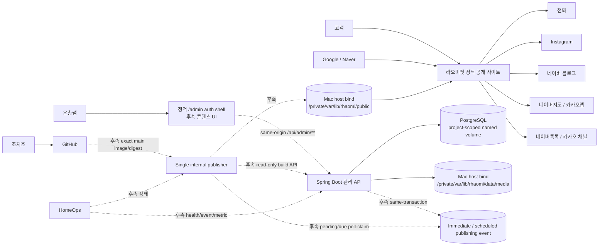

# 시스템 컨텍스트

## 목표

공개 사이트는 정적이고 검색엔진이 읽기 쉬워야 한다. 관리 backend나 PostgreSQL 장애가 고객 사이트 장애로 이어지면 안 된다. 운영자가 콘텐츠를 직접 관리하는 기능은 인증 기반부터 도메인별로 순차 구현한다.

## 컨텍스트

실선은 현재 기반 또는 공개 외부 연결이고, 점선은 후속 Issue에서 구현할 관리·게시 경로다.

## 현재 구현 경계

- Next.js Static Export 공개 frontend
- Spring Boot session auth와 견종·서비스·공지·갤러리·매장정보·private media 관리자 API
- PostgreSQL과 Flyway V1~V9 publication producer·claim/generation state
- local/test bootstrap과 `/admin/` 인증 셸·콘텐츠 CRUD UI
- active generation에 묶인 stateless internal read-only build snapshot·public-scope media API
- `/api/build/**`를 먼저 거부하는 local same-origin gateway, 최소 health와 Hosted CI

publisher polling·30초 debounce, transformer·responsive derivative·release manifest·atomic switch와 public content route는 아직 없다.

## 신뢰 경계

### 공개 경계

- 고객 사이트
- 검색엔진 crawler
- 외부 문의·지도 링크

공개 사이트는 정적 파일만 제공한다. 고객 브라우저에 DB 정보, 관리 API credential이나 내부 관리자 구조를 전달하지 않는다.

### 관리자 경계

- 후속 same-origin `/admin`
- Spring Boot `/api/admin/**`
- 관리자 server session

login/csrf 외 관리 endpoint는 인증이 필요하고 state-changing request는 CSRF token을 요구한다.

### 내부 운영 경계

- PostgreSQL
- production project-scoped Docker named volume의 PostgreSQL PGDATA
- `/private/var/lib/rhaomi` 아래 private canonical media·public release·publisher state/lock
- 향후 build API·immediate/due publishing event·single publisher
- 향후 encrypted restic backup과 HomeOps
- Docker internal network

PostgreSQL과 내부 작업 서비스는 공용 인터넷에 직접 노출하지 않는다.

Mac host source와 Linux container target을 분리한다. `/private/var/lib/rhaomi`가 host filesystem authority이고 `/srv/rhaomi`는 명시된 web·publisher container 내부 target에만 사용할 수 있다. PostgreSQL raw named volume은 public/media bind source나 required restic backup input이 아니다.

## 핵심 속성

1. 고객 요청은 PostgreSQL query나 backend API 호출을 발생시키지 않는다.
2. 고객 요청은 관리 backend 가용성에 의존하지 않는다.
3. 콘텐츠 mutation 또는 notice 게시·만료 시간 경계는 향후 durable event와 `publishGeneration`을 거쳐 static build가 성공해야 고객에게 반영된다.
4. build 실패는 기존 공개 사이트를 변경하지 않는다.
5. 원본 이미지는 공개 web root에 두지 않는다.
6. 외부 link가 없는 채널은 UI에 나타나지 않는다.
7. HomeOps는 privacy-safe health/status/event만 읽고 관리자 콘텐츠 권한을 갖지 않는다.
