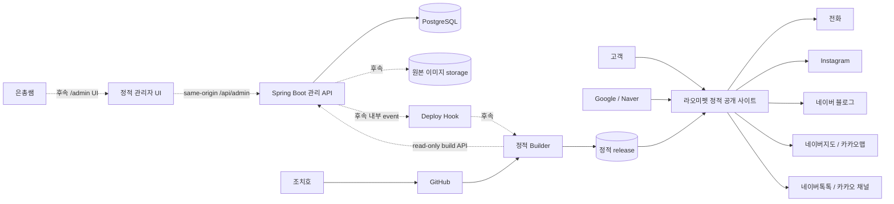

# 시스템 컨텍스트

## 목표

공개 사이트는 정적이고 검색엔진이 읽기 쉬워야 한다. 관리 backend나 PostgreSQL 장애가 고객 사이트 장애로 이어지면 안 된다. 운영자가 콘텐츠를 직접 관리하는 기능은 인증 기반부터 도메인별로 순차 구현한다.

## 컨텍스트

실선은 현재 기반 또는 공개 외부 연결이고, 점선은 후속 Issue에서 구현할 관리·게시 경로다.

## 현재 구현 경계

- Next.js Static Export 공개 frontend
- Spring Boot `admin_users`와 session auth API
- PostgreSQL과 Flyway V1
- local/test bootstrap
- 최소 health와 Hosted CI

콘텐츠 CRUD, `/admin` UI, 파일 storage, build API와 deploy hook은 아직 없다.

## 신뢰 경계

### 공개 경계

- 고객 사이트
- 검색엔진 crawler
- 외부 문의·지도 링크

공개 사이트는 정적 파일만 제공한다. 고객 브라우저에 DB 정보, 관리 API credential이나 내부 관리자 구조를 전달하지 않는다.

### 관리자 경계

- 후속 same-origin `/admin`
- Spring Boot `/api/admin/**`
- 관리자 server session

login/csrf 외 관리 endpoint는 인증이 필요하고 state-changing request는 CSRF token을 요구한다.

### 내부 운영 경계

- PostgreSQL
- 향후 원본 이미지 storage
- 향후 build API·deploy hook·builder
- backup
- Docker internal network

PostgreSQL과 내부 작업 서비스는 공용 인터넷에 직접 노출하지 않는다.

## 핵심 속성

1. 고객 요청은 PostgreSQL query나 backend API 호출을 발생시키지 않는다.
2. 고객 요청은 관리 backend 가용성에 의존하지 않는다.
3. 콘텐츠는 향후 게시 후 static build가 성공해야 고객에게 반영된다.
4. build 실패는 기존 공개 사이트를 변경하지 않는다.
5. 원본 이미지는 공개 web root에 두지 않는다.
6. 외부 link가 없는 채널은 UI에 나타나지 않는다.
