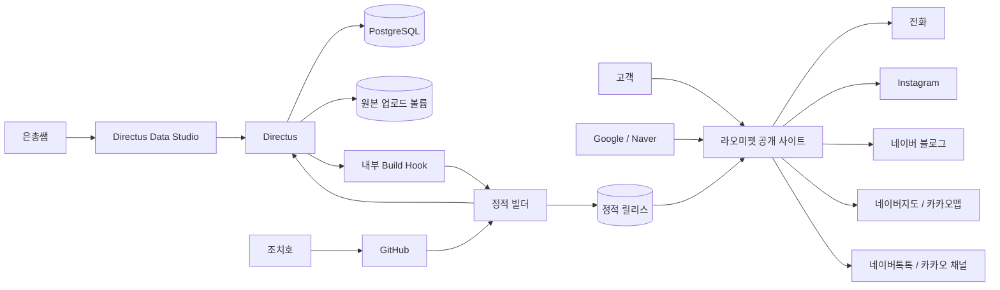

# 시스템 컨텍스트

## 목표

공개 사이트는 정적이고 빠르며 검색엔진이 읽기 쉬워야 한다. 운영자는 개발자 도움 없이 콘텐츠를 관리해야 한다. CMS 장애가 고객 사이트 장애로 이어지면 안 된다.

## 컨텍스트

## 신뢰 경계

### 공개 경계

- 고객 사이트
- 검색엔진 크롤러
- 외부 문의·지도 링크

공개 사이트는 정적 파일만 제공한다. 고객 브라우저에 CMS 토큰, DB 정보, 관리자 URL 내부 구조를 전달하지 않는다.

### 관리자 경계

- Directus Data Studio
- Directus API
- 운영자 계정

관리자 영역은 인증이 필요하며 공개 사이트와 별도 hostname을 사용한다.

### 내부 운영 경계

- PostgreSQL
- 원본 업로드 볼륨
- deploy hook
- 빌더
- 백업
- Docker network

이 서비스들은 공용 인터넷에 직접 노출하지 않는다.

## 핵심 속성

1. 고객 요청은 PostgreSQL 쿼리를 발생시키지 않는다.
2. 고객 요청은 Directus 가용성에 의존하지 않는다.
3. 콘텐츠는 게시 후 빌드가 성공해야 고객에게 반영된다.
4. 빌드 실패는 기존 공개 사이트를 변경하지 않는다.
5. 원본 이미지는 공개 웹 루트에 두지 않는다.
6. 외부 링크가 없는 채널은 UI에 나타나지 않는다.
